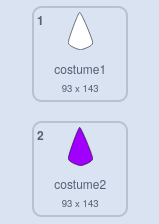

## تلوين الماندالا

<div style="display: flex; flex-wrap: wrap">
<div style="flex-basis: 200px; flex-grow: 1; margin-right: 15px;">
تعد إضافة اللون إلى الماندالا نشاطًا علاجيًا وإبداعيًا أيضًا. أضف الفرصة لتلوين أجزاء مختلفة من المندالا.
</div>
<div>
{:width="300px"}
</div>
</div>

**نصيحة:** ، إذا كنت ترغب في ذلك، يمكنك طباعة الماندالا الخاصة بك قبل إضافة اللون إليها في هذه الخطوة، واستخدامها كنمط تلوين للتلوين يدويًا.

--- task ---

قم بإلقاء نظرة على الأزياء الحالية لكائنك **الشكل**. سترى أن هناك زيين، أحدهما أبيض والآخر مملوء.



--- /task ---

لإضافة لون إلى الماندالا الخاصة بك، يجب على كل شكل من الأشكال المستنسخة تغيير مظهره ``{:class="block3looks"} ثم تأثير اللون ``{:class="block3looks"} عند النقر على النسخة المستنسخة. سيكون الزي الجديد أكبر بمقدار **واحد** من الزي السابق، لذلك سيتغير إلى النسخة الملونة ثم إلى الألوان المختلفة.

--- task ---

أضف `عندما ينقر هذا الكائن على الكتلة`{:class="block3events"}، ثم استخدم عامل التشغيل `+`{:class="block3operators"} لتغيير رقم الزي.


```blocks3
when this sprite clicked
switch costume to ((answer) + (1))
```

--- /task ---

--- task ---

قم بإضافة كتلة `تغيير لون التأثير`{:class="block3looks"} إلى هذا البرنامج النصي، بحيث يتغير اللون قليلاً في كل مرة يتم النقر فوق الكائن فيها.


```blocks3
when this sprite clicked
switch costume to ((answer) + (1))
change [color v] effect by (25)
```

--- /task ---

ربما تتذكر إضافة كتلة `Ghost`{:class="block3myblocks"} إلى مشروعك في الخطوة الأخيرة. من المفترض أن تكون الآن قادرًا على رؤية ما يحدث عند تغيير الرقم الذي تتصل به `Ghost`{:class="block3myblocks"}.

--- task ---

قم بإنشاء نوع تأثير التلوين الذي تريده عن طريق تغيير أرقام `Ghost`{:class="block3myblocks"}. الرقم الأقل `شبح`{:class="block3myblocks"} يعني أن اللون أكثر تشبعًا، مثل قلم التحديد الدائم. الرقم العالي `شبح`{:class="block3myblocks"} يعني أن اللون أقل تشبعًا، مثل الألوان المائية.

--- /task ---

--- task ---

**اختبار:** انقر فوق العلم، واختر الزي الخاص بك، ثم حاول النقر فوق المستنسخات لتغيير ألوانها.


يجب أن تحصل على تأثير الكاليدسكوب عندما تكون الألوان على الطبقات فوق بعضها البعض.

--- /task ---

إذا أعجبتك الماندالا التي قمت بإنشائها، فيمكنك النقر **الفأرة الأيمن فوق** على الجزء الرئيسي واختيار حفظ الصورة.


--- save ---
