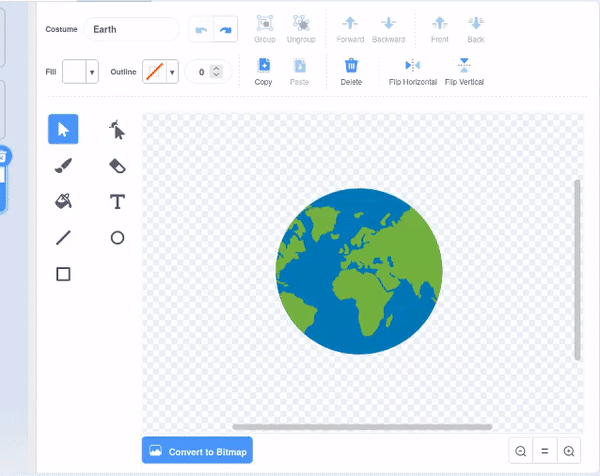

## أنشئ ماندالا أخرى

<div style="display: flex; flex-wrap: wrap">
<div style="flex-basis: 200px; flex-grow: 1; margin-right: 15px;">
قم بإنشاء ماندالا أخرى بسهولة باستخدام كتل التعليمات البرمجية المحسنة.
</div>
<div>

</div>
</div>

لديك زيان تستخدمهما لإنشاء الماندالا الملونة. أضف المزيد من الأزياء لإضفاء طابع شخصي على الماندالا الخاصة بك بشكل أكبر.

--- task ---

**اختر:** أضف زيًا آخر. هنا تم اختيار زي **Earth**.


لا يهم الزي الذي تختاره، ولكن يجب عليك التأكد من أنه زي **Vector** وليس زي **Bitmap**. يمكنك معرفة أنك اخترت زي **Vector** ، حيث سترى زرًا يحمل الاسم **Convert to Bitmap**. **لا تنقر هذا الزر**. إذا قمت بتحديد زي يمثل **Bitmap**، فاحذفه واختر زيًا آخر.


--- /task ---

--- task ---

قم بإزالة كل الألوان من الزي حتى تحصل على المخطط التفصيلي فقط. حدد الزي بالكامل وقم بتغيير **ملء** **التشبع** إلى `0` والمخطط التفصيلي **** **السطوع** إلى `0`.



--- /task ---

--- task ---

قم بتكرار هذا الزي، ثم كرر العملية، هذه المرة قم بتغيير اللون **املأ** إلى لون داكن من اختيارك.


--- /task ---

--- task ---

كرر هذه العملية عدة مرات مع أزياء متجهة مختلفة، لتمنح نفسك أنماطًا مختلفة من الأزياء.


--- /task ---

للتأكد من أنه يمكنك تلوين المنضدة الشخصية الخاصة بك، قم بإعادة ترتيب الأزياء الخاصة بك والتحقق من مفاتيح تبديل المظهر إلى الرقم الصحيح.

--- task ---

إعادة ترتيب الأزياء الخاصة بك، بحيث تكون جميع المملوءة بالبيض في الأعلى، وتلك المملوءة بالألوان في ألأدنى ، ولكنها لا تزال بنفس الترتيب.


--- /task ---

تذكر أن تغير الزي الذي ستتحول إليه الماندالا حتى تتمكن من تلوين الماندالا الجديدة. في المشروع النموذجي، هناك أربعة ماندالا لذلك قمنا بتغيير رقم الزي من "1" إلى "4"


```blocks3
when this sprite clicked
+ switch costume to ((answer) + (4))
change [color v] effect by (25)
```

--- task ---

**اختبار:** قم بالتبديل إلى أحد أزيائك الجديدة وانقر فوق العلم الأخضر لرؤية النموذج الذي تم إنشاؤه.

--- /task ---

--- save ---
