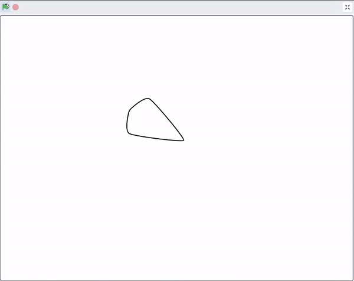
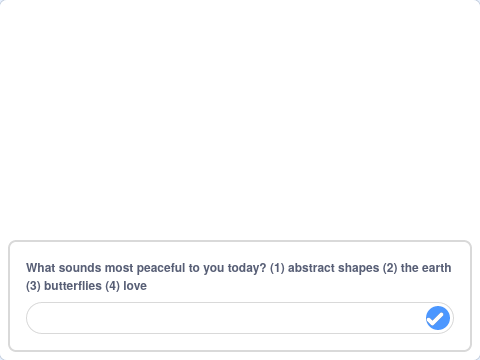

## اختر الماندالا الخاصة بك

<div style="display: flex; flex-wrap: wrap">
<div style="flex-basis: 200px; flex-grow: 1; margin-right: 15px;">
كل شخص مختلف. أعطِ الشخص الذي يستخدم برنامجك لمندالا خياراً بناءً على ما يجده أكثر سلمية.
</div>
<div>
{:width="300px"}
</div>
</div>

يجب أن يكون لديك الآن على الأقل ماندالاين اثنين مختلفتان. يمكنك استخدام كتلة `اسأل`{:class="block3sensing"} لإنشاء قائمة ابدأ، مع إعطاء خيار لمن يستخدم برنامج ماندالا الخاص بك.

<p style="border-left: solid; border-width:10px; border-color: #0faeb0; background-color: aliceblue; padding: 10px;">
<span style="color: #0faeb0">**قوائم البدء**</span> غالبًا ما توجد في الألعاب والتطبيقات. فهي تسمح للشخص الذي يلعب اللعبة أو يستخدم التطبيق بالاختيار من بين عدد من الخيارات، على سبيل المثال، الشخصية التي يريد لعبها، أو الإعدادات التي يريدها.
</p>

قم بإنشاء السؤال الذي ستطرحه في قائمة البداية.

--- task ---

أضف `اسأل وانتظر`{:class="block3sensing"} أسفل `عند النقر على العلم`{:class="block3events"} واختر النص لسؤالك، مثل المثال أدناه.


```blocks3
when flag clicked
+ hide
+ ask [What feels most peaceful to you today? (1) abstract shapes (2) the earth (3) butterflies (4) love] and wait
show
setup: size (60) ghost (50) y (10) move (10) ::custom
pattern: repeat (3) size (10) move (5) turn (60) ::custom
pattern: repeat (5) size (10) move (45) turn (30) ::custom
pattern: repeat (6) size (10) move (90) turn (30) ::custom
hide
```

--- /task ---

السبب وراء إخفاء الكائن قبل استخدام `اسأل وانتظر`{:class="block3sensing"} هو أن السؤال يظهر في أسفل المرحلة، وليس على شكل فقاعة كلام من الكائن.



قم بمطابقة الإجابة مع الكائن المناسب لإظهار الماندالا الصحيحة.

--- task ---

أضف زي التبديل `إلى الكتلة`{:class="block3looks"} `الإجابة`{:class="block3sensing"} أسفل الكتلة `اسأل وانتظر`{:class="block3sensing"}.


```blocks3
when flag clicked
hide
ask [What feels most peaceful to you today? (1) abstract shapes (2) the earth (3) butterflies (4) love] and wait
+ switch costume to (answer)
show
setup: (60) (50) (10) (10) ::custom
pattern: (3) (10) (5) (60) ::custom
pattern: (5) (10) (45) (30) ::custom
pattern: (6) (10) (90) (30) ::custom
hide
```

--- /task ---

--- task ---

**الاختبار**: جرب مشروع الماندالا الخاص بك عن طريق النقر على العلم واختيار رقم.

--- /task ---

--- save ---
