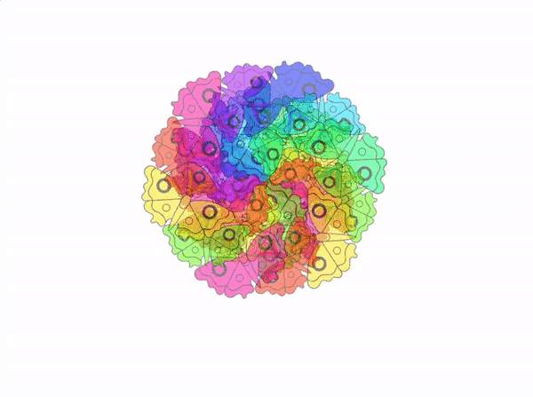

## قم بترقية او تطوير مشروعك

اجعل المندالا الخاصة بك تتحرك مثل المشكال.

يمكنك إضافة بضع كتل لتتحرك مستنسخاتك عند الضغط على مفتاح أو عند النقر على كائن لمزيد من الاسترخاء. ربما يمكن تشغيل بعض الموسيقى الهادئة أيضًا.

--- collapse ---
---
العنوان: المشروع المكتمل
---

يمكنك عرض [المشروع المكتمل هنا](https://scratch.mit.edu/projects/536953224/){:target="_ blank"}.

--- /collapse ---

--- save ---
