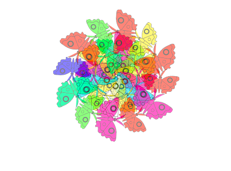

## Byddi di'n creu

Creu rhaglen sy'n cynhyrchu mandalas.

**Celf a gynhyrchir gan gyfrifiadur** neu **celf ddigidol** yn syml yw celf a wneir gan ddefnyddio cyfrifiadur. Gall amrywio o luniadau a grëwyd ar dabled, i ysgrifennu rhaglenni Deallusrwydd Artiffisial (AI) i alluogi cyfrifiadur i greu ei gelf ei hun. Yn y prosiect hwn, rwyt ti'n mynd i ddefnyddio rhaglennu yn Scratch i greu gwaith celf ystyriol.

Mae **Mandala** yn air Sansgrit sy'n golygu'n fras "cylch". Yn aml mae manadalas yn ddyluniadau cylchol sydd â lliwiau, siapiau a phatrymau ailadroddus. Mewn traddodiadau Bwdhaidd a Hindŵaidd, mae mandalas yn ddefnyddiol wrth fyfyrio. Mae creu mandalas yn weithgaredd ymlaciol ac ystyriol.

Byddi di'n:
+ Defnyddia glonau i greu patrymau ailadroddus
+ Defnyddia `Fy Mlociau`{:class='block3myblocks'} i wneud y gorau o dy raglen gelf a gynhyrchir gan gyfrifiadur
+ Defnyddia flociau gweithredu adio `+`{:class='block3operators'} a thynnu `-`{:class='block3operators'} i newid ymddangosiad a lleoliad corlun

--- no-print ---

### Chwarae ▶️

--- task ---

  
Dewisa siâp a gwylia wrth i'r cyfrifiadur gynhyrchu mandala. Gelli di liwio siapiau'r mandala trwy glicio arnyn nhw (clicia sawl tro am wahanol liwiau), ac yna gwasg'r <kbd>bylchwr</kbd>.

Elli di weld y patrwm? Sut wyt ti'n meddwl bod Scratch yn creu'r patrwm hwnnw?

Dewisa siâp gwahanol nawr a chymer olwg ar fandala newydd. Ydy e'n edrych yr un peth? A yw'n dilyn yr un patrwm?

<iframe src="https://scratch.mit.edu/projects/536953224/embed" allowtransparency="true" width="485" height="402" frameborder="0" scrolling="no" allowfullscreen></iframe>

--- /task ---

--- /no-print ---

--- print-only ---

--- /print-only ---
