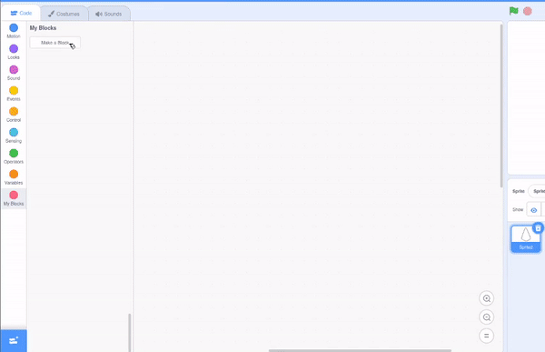

## Clonio siapiau i wneud patrwm

<div style="display: flex; flex-wrap: wrap">
<div style="flex-basis: 200px; flex-grow: 1; margin-right: 15px;">
Clonio siapiau i wneud patrwm.
</div>
<div>
{:width="300px"}
</div>
</div>

--- task ---

Agora [brosiect cychwyn arni gyda Scratch](https://scratch.mit.edu/projects/540476254/){:target="_blank"}. Bydd Scratch yn agor mewn tab arall ar y porwr.

Os wyt ti'n gweithio heb gyswllt, gelli lawrlwytho'r prosiect [cychwyn arni](https://scratch.mit.edu/projects/540476254/){:target = "_blank"}.

--- /task ---

Dylet weld corlun siâp sy'n edrych ychydig fel petal blodyn.

Byddi di'n defnyddio `fy mlociau`{:class="block3myblocks"} i greu patrwm gyda'r siâp hwn. Efallai dy fod yn cofio creu `fy mlociau`{:class="block3myblocks"} i drefnu dy god yn [Nature Rover](https://projects.raspberrypi.org/en/projects/nature-rover/3){:target="_blank"}, ac i ailadrodd yr un cod yn [Ystafell Posau](https://projects.raspberrypi.org/en/projects/puzzle-room/4){:target ="_gwag"}. Gellir hefyd defnyddio `fy mlociau`{:class="block3myblocks"} i ailddefnyddio gweithredoedd mewn ffordd wahanol.

--- task ---

Cer i `My Blocks`{:class='block3myblocks'} ac enwa dy flociau (rydym wedi eu galw'n `patrwm:`{:class="block3myblocks"}). Ychwanega `ailadrodd`{:class="block3myblocks"} fel label i nodi'r mewnbwn cyntaf neu'r hyn y mae rhaglennydd yn ei alw'n **baramedr**. Yna clicia "Ychwanegu Mewnbwn" i greu'r **paramedr** o'r enw `ailadrodd`{:class="block3myblocks"}.





```blocks3
define pattern: repeat (repeat)
```

--- /task ---

I ddylunio sut mae patrwm yn cael ei wneud, y cam cyntaf yw `diffinio patrwm`{:class='block3myblocks'}.

--- task ---

Llusga'r paramedr `ailadrodd`{:class='block3myblocks'} o `diffinio patrwm`{:class='block3myblocks'} i mewn i floc dolen `ailadrodd`{:class='block3control'}.


```blocks3
define pattern: repeat (repeat)
repeat (repeat)
```

--- /task ---

Byddi nawr yn defnyddio blociau `clôn`{:class='block3control'} i wneud i'r un bloc ymddangos nifer o weithiau. Sicrha dy fod hefyd yn ychwanegu cod i newid maint a lleoliad y corlun, fel arall bydd y sprites yn cael eu pentyrru ar ben ei gilydd ac ni fyddi di'n gallu eu gweld.

--- task ---

Ychwanega ychydig o god i ddolen `ailadrodd`{:class='block3myblocks'} o dy batrwm ``{:class='block3myblocks'}.


```blocks3
define pattern: repeat (repeat)
repeat (repeat)
+ change size by (10) //So you can see the clones
+ move (5) steps //So you can see the clones
+ create clone of (myself v)
```

--- /task ---

**Awgrym:** Mae `diffinio`{:class='block3myblocks'} yn gwneud amlinelliad patrwm cyffredinol. Mae'r hyn rwyt ti'n ei greu nawr gyda `my blocks`{:class="block3myblocks"} yn debyg i greu stensil sbirograff; dyma'r offeryn ac fe'i defnyddir nes ymlaen i greu'r patrwm.


--- task ---

Creu patrwm gyda `fy mlociau`{:class="block3myblocks"}. Cael y patrwm ``{:class='block3myblocks'} i `ailadrodd`{:class='block3myblocks'} nifer o weithiau `pan glicir ar y faner`{:class='block3events'}.


```blocks3
when flag clicked
show //Shape is displayed 
set size to (50) % //Not too big
go to x: (0) y: (0) //Displayed in the middle
pattern: repeat (3) ::custom
```

**Profi:** Gelli weld sut olwg sydd ar dy batrwm trwy glicio ar y faner werdd i redeg dy raglen.

--- /task ---

Dylet weld dechrau patrwm mandala. Bydd ychwanegu mwy o **baramedrau**, neu ofynion, at dy batrwm yn creu rhan gyntaf dy fandala.

--- save ---
