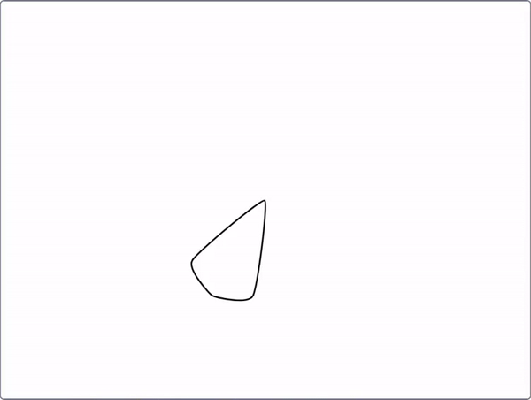

## Gwna mandala

<div style="display: flex; flex-wrap: wrap">
<div style="flex-basis: 200px; flex-grow: 1; margin-right: 15px;">
Crea fwy o batrymau i wneud mandala!
</div>
<div>
{:width="300px"}
</div>
</div>

--- task ---

De-glicia ar dy floc `diffinio patrwm`{:class="block3myblocks"} a dewis **Golygu** i ychwanegu mwy o baramedrau.


Gelli ddechrau drwy ychwanegu label testun `maint`{:class="block3myblocks"} a mewnbwn `maint`{:class="block3myblocks"}. Yna, ychwanega label a mewnbwn `symud`{:class="block3myblocks"}, a defnyddia'r paramedrau hyn yn y blociau isod.


```blocks3
define pattern: repeat (repeat) size (size) move (move)
repeat (repeat)
change size by (size)
move (move) steps
create clone of (myself v)

when flag clicked
pattern: repeat (3) size (10) move (5)
```

--- /task ---

--- task ---

**Profi:** Gelli weld sut olwg sydd ar dy batrwm trwy glicio ar y faner werdd i redeg dy raglen. Nid yw'n edrych fel mandala eto! Elli di feddwl sut y gallet ti wneud y patrwm yn gylchol?

--- /task ---

I wneud dy batrwm yn gylchol ac edrych hyd yn oed yn debycach i fandala, ychwanega fewnbwn arall.

--- task ---

Ychwanega fewnbwn arall o'r enw `troi`{:class="block3myblocks"}. Yna, yn ogystal â symud dy glôn, gelli di ei droi hefyd.


```blocks3
define pattern: repeat (repeat) size (size) move (move) turn (turn)
repeat (repeat)
change size by (size)
move (move) steps
create clone of (myself v)
+ change size by ([0] - (size))
+ move ([0] - (move)) steps
+ turn right (turn) degrees
+ move (move) steps
+ create clone of (myself v)
+ move ([0] - (move)) steps
+ turn right (turn) degrees
end
```

--- /task ---

Mae mandalas yn aml yn gymhleth - gallant gael llawer o resi gwahanol sy'n dilyn patrymau tebyg. Gelli greu patrwm sylfaen i weddill y rhesi mandala adeiladu arno.

--- task ---

Rho gynnig ar chwarae o gwmpas gyda rhifau gwahanol yn dy batrwm ``{:class="block3myblocks"}. Gelli ailosod safle a maint dy gorlun unrhyw bryd yr wyt yn dymuno.


```blocks3
when flag clicked
pattern repeat (3) size (0) move (0) turn (60) ::custom
```

--- /task ---


Nawr bod gen ti batrwm sylfaenol, gelli ddefnyddio'ch `patrwm`{:class="block3myblocks"} nifer o weithiau i wneud patrwm sy'n ailadrodd, neu 'resi' mandala. Trwy ddefnyddio'r un cod dro ar ôl tro, rwyt ti'n gwneud rhaglen sydd wedi'i **optimeiddio**.

<p style="border-left: solid; border-width:10px; border-color: #0faeb0; background-color: aliceblue; padding: 10px;">
Mae <span style="color: #0faeb0">**optimeiddio** </span> yn golygu gwneud pethau yn y ffordd fwyaf effeithlon. Cymer olwg ar y diagram isod. Gallet fynd o A i E trwy ddilyn y llwybr A-->B-->C-->D-->E. Optimeiddio fyddai mynd A-->D-->E, sy'n cynnwys llai o gamau a phellter byrrach.

</p>

--- task ---

O dan dy floc `pan glicir ar y faner`{:class="block3events"}, ychwanega ychydig mwy o **alwadau** i dy batrwm ``{:class="block3myblocks"}.


```blocks3
when flag clicked
pattern repeat (3) size (0) move (0) turn (60) ::custom
pattern repeat (6) size (10) move (45) turn (30) ::custom
pattern repeat (6) size (10) move (90) turn (30) ::custom
```

--- /task ---

--- task ---

**Prawf:** Clicia ar y faner werdd i weld pa batrwm sy'n cael ei greu. Gelli newid y rhifau i arbrofi gyda phatrymau yr wyt yn eu hoffi, neu hyd yn oed ychwanegu mwy o alwadau i' dy `batrwm`{:class="block3myblocks"}.

--- /task ---

--- save ---
