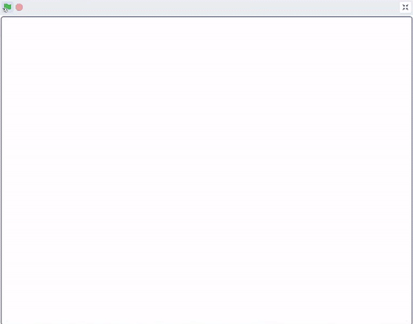
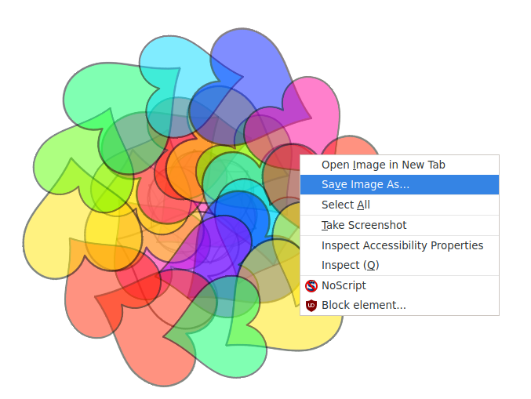

## Lliwio mandala

<div style="display: flex; flex-wrap: wrap">
<div style="flex-basis: 200px; flex-grow: 1; margin-right: 15px;">
Mae ychwanegu lliw at fandala yn therapiwtig yn ogystal â bod yn weithgaredd creadigol. Ychwanega'r cyfle i liwio gwahanol rannau o'r mandalas.
</div>
<div>
{:width="300px"}
</div>
</div>

**Awgrym:** Os wyt ti eisiau, gelli argraffu dy fandala cyn ychwanegu lliw ato yn y cam hwn, a'i ddefnyddio fel patrwm lliwio i'w liwio â llaw.

--- task ---

Cymer olwg ar y gwisgoedd presennol ar gyfer dy **siâp**. Fe weli fod dwy wisg, un yn wyn a'r llall wedi'i llenwi.


--- /task ---

I ychwanegu lliw at dy fandala, dylai pob un o'r siapiau clôn newid ei `gwisg`{:class="block3looks"} ac yna ei `effaith lliw`{:class="block3looks"} pan glicir ar y clôn. Bydd y wisg newydd **un** yn fwy na beth bynnag oedd y wisg flaenorol, felly bydd yn newid i'r fersiwn lliw ac yna i'r lliwiau gwahanol.

--- task ---

Ychwanega floc `pan glicir ar y corlun hwn`{:class="block3events"}, ac yna defnyddia'r gweithredwr `+`{:class="block3operators"} i newid rhif y wisg.


```blocks3
when this sprite clicked
switch costume to ((answer) + (1))
```

--- /task ---

--- task ---

Ychwanega floc `newid effaith lliw`{:class="block3looks"} i'r sgript hon, fel bod y lliw yn newid ychydig bob tro y bydd y corlun yn cael ei glicio.


```blocks3
when this sprite clicked
switch costume to ((answer) + (1))
change [color v] effect by (25)
```

--- /task ---

Efallai dy fod yn cofio ychwanegu mewnbwn bloc `ysbryd`{:class="block3myblocks"} i dy brosiect yn y cam diwethaf. Dylet nawr allu gweld beth sy'n digwydd pan fyddi di'n newid y rhif lle rwyt ti'n galw `ysbryd`{:class="block3myblocks"}.

--- task ---

Crea'r math o effaith lliwio rwyt ti ei eisiau trwy newid dy rifau `ysbryd`{:class="block3myblocks"}. Bydd rhif `ysbryd`{:class="block3myblocks"} is yn golygu bod y lliw yn fwy dirlawn, fel marciwr parhaol. Bydd rhif `ysbryd`{:class="block3myblocks"} uchel yn golygu bod y lliw yn llai dirlawn, fel dyfrlliwiau.

--- /task ---

--- task ---

**Profi:** Clicia'r faner, dewisa dy wisg, ac yna ceisia glicio ar y clonau i newid eu lliwiau.


Dylet gael effaith caleidosgop pan fydd lliwiau'n cael eu haenu ar ben ei gilydd.

--- /task ---

Os wyt ti'n hoffi'r mandala rwyt ti wedi'i greu yna gelli di **de-glicio** ar y llwyfan, a dewis cadw'r ddelwedd.



--- save ---
