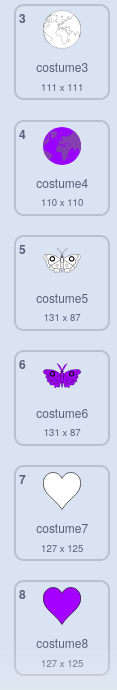

## Creu mandala arall

<div style="display: flex; flex-wrap: wrap">
<div style="flex-basis: 200px; flex-grow: 1; margin-right: 15px;">
Crea mandala arall yn hawdd gan ddefnyddio dy flociau cod wedi'u hoptimeiddio.
</div>
<div>

</div>
</div>

Mae gennyt ddwy wisg yr wyt yn eu defnyddio i greu dy fandala lliw. Ychwanega ychydig mwy o wisgoedd i bersonoli dy fandala hyd yn oed yn fwy.

--- task ---

**Dewisa:** Ychwanegu gwisg arall. Yma mae'r wisg **Earth** wedi'i dewis.


Nid oes ots pa wisg y byddi di'n ei dewis, ond dylet sicrhau mai gwisg **Vector** ydyw ac nid gwisg **Bitmap**. Gelli ddweud dy fod wedi dewis gwisg **Fector**, oherwydd fe weli fotwm wedi'i labelu **Trosi i Bitmap**. **Paid â chlicio ar y botwm hwn**. Os wyt ti wedi dewis gwisg sy'n un **Bitmap**, yna dilëa hi a dewisa un arall.


--- /task ---

--- task ---

Tynna'r holl liw o'r wisg fel dy fod yn cael yr amlinelliad yn unig. Dewisa'r wisg gyfan a newidia **Dirlawnder** y **Llanw** i `0` a **Disgleirdeb** yr **Amlinelliad** i `0`.


--- /task ---

--- task ---

Dyblyga'r wisg hon, ac yna ailadrodda'r broses, y tro hwn gan newid y lliw **Llanw** i liw tywyll o dy ddewis.


--- /task ---

--- task ---

Ailadrodda'r broses hon ychydig rhagor o weithiau gyda gwisgoedd vector gwahanol, i roi gwahanol arddulliau o wisgoedd i ti dy hun.



--- /task ---

I wneud yn siŵr dy fod yn gallu lliwio dy fandalas personol, ail-drefna dy wisgoedd a gwirio bod y gwisg yn newid i'r rhif cywir.

--- task ---

Ail-drefna dy wisgoedd, fel bod pob un wedi'i lenwi â gwyn ar y brig, a'r rhai sydd wedi'u llenwi â lliwiau yn is i lawr, ond yn dal yn yr un drefn.


--- /task ---

Cofia newid i ba wisg y mae'r mandala yn newid er mwyn i ti allu lliwio dy fandalas newydd. Yn y prosiect enghreifftiol, mae pedwar mandala felly fe newidion ni rhif y wisg o '1' i '4'


```blocks3
when this sprite clicked
+ switch costume to ((answer) + (4))
change [color v] effect by (25)
```

--- task ---

**Profi:** Newidia i un o dy wisgoedd newydd a chlicia ar y faner werdd i weld y patrwm a gynhyrchir.

--- /task ---

--- save ---
