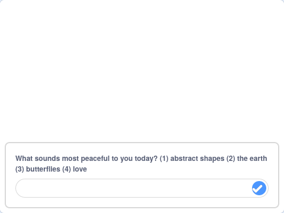

## Dewisa dy fandala

<div style="display: flex; flex-wrap: wrap">
<div style="flex-basis: 200px; flex-grow: 1; margin-right: 15px;">
Mae pawb yn wahanol. Rho ddewis i'r person sy'n defnyddio dy raglen mandala yn seiliedig ar yr hyn sydd fwyaf heddychlon iddynt.
</div>
<div>
{:width="300px"}
</div>
</div>

Dylai fod gennyt o leiaf ddau fandala gwahanol nawr. Gelli ddefnyddio bloc `gofyn`{:class="block3sensing"} i greu dewislen cychwyn, gan roi dewis i bwy bynnag sy'n defnyddio dy raglen mandala.

<p style="border-left: solid; border-width:10px; border-color: #0faeb0; background-color: aliceblue; padding: 10px;">
Mae <span style="color: #0faeb0">**dewislenni cychwyn**</span> yn aml yn cael eu canfod mewn gemau ac apiau. Maen nhw'n gadael i'r person sy'n chwarae'r gêm neu'n defnyddio'r ap ddewis o nifer o opsiynau, er enghraifft, pa gymeriad maen nhw eisiau ei chwarae, neu pa osodiadau maen nhw eu heisiau.
</p>

Crea'r cwestiwn y byddi di'n ei ofyn yn dy ddewislen cychwyn.

--- task ---

Ychwanega floc `gofyn ac aros`{:class="block3sensing"} o dan `pan glicir ar y faner`{:class="block3events"} a dewisa'r testun ar gyfer dy gwestiwn, fel yr enghraifft isod.


```blocks3
when flag clicked
+ hide
+ ask [What feels most peaceful to you today? (1) abstract shapes (2) the earth (3) butterflies (4) love] and wait
show
setup: size (60) ghost (50) y (10) move (10) ::custom
pattern: repeat (3) size (10) move (5) turn (60) ::custom
pattern: repeat (5) size (10) move (45) turn (30) ::custom
pattern: repeat (6) size (10) move (90) turn (30) ::custom
hide
```

--- /task ---

Y rheswm dros guddio'r corlun cyn defnyddio `gofyn ac aros`{:class="block3sensing"} yw fel bod y cwestiwn yn ymddangos ar waelod y llwyfan, yn hytrach nag fel swigen siarad o'r corlun.



Una'r ateb gyda'r corlun cywir i ddangos y mandala cywir.

--- task ---

Ychwanega floc `gwisg newid i`{:class="block3looks"} `ateb`{:class="block3sensing"} o dan y bloc `gofyn ac aros`{:class="block3sensing"}.


```blocks3
when flag clicked
hide
ask [What feels most peaceful to you today? (1) abstract shapes (2) the earth (3) butterflies (4) love] and wait
+ switch costume to (answer)
show
setup: (60) (50) (10) (10) ::custom
pattern: (3) (10) (5) (60) ::custom
pattern: (5) (10) (45) (30) ::custom
pattern: (6) (10) (90) (30) ::custom
hide
```

--- /task ---

--- task ---

**Profi**: Rho gynnig ar dy brosiect mandala trwy glicio ar y faner a dewis rhif.

--- /task ---

--- save ---
