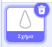

## Κλωνοποίησε σχήματα για να φτιάξεις ένα μοτίβο

<div style="display: flex; flex-wrap: wrap">
<div style="flex-basis: 200px; flex-grow: 1; margin-right: 15px;">
Κλωνοποίησε αντικείμενα για τη δημιουργία ενός μοτίβου.
</div>
<div>
{:width="300px"}
</div>
</div>

--- task ---

Άνοιξε το [αρχικό έργο Scratch](https://scratch.mit.edu/projects/540476254/){:target="_blank"}. Το Scratch θα ανοίξει σε νέα καρτέλα του φυλλομετρητή.

Αν εργάζεσαι εκτός σύνδεσης, μπορείς να κάνεις λήψη του [αρχικού έργου](https://scratch.mit.edu/projects/540476254/){:target="_blank"}.

--- /task ---

Θα δεις ένα αντικείμενο σχήματος που μοιάζει με πέταλο λουλουδιών.

Θα χρησιμοποιήσεις την κατηγορία `Οι εντολές μου`{:class="block3myblocks"} για να δημιουργήσεις ένα μοτίβο με αυτό το σχήμα. Μπορεί να θυμάσαι ότι δημιούργησες την κατηγορία `οι εντολές μου`{:class="block3myblocks"} για να οργανώσεις τον κώδικά σου στο [Nature Rover](https://projects.raspberrypi.org/en/projects/nature-rover/3){:target="_blank"}, και για να επαναλάβεις τον ίδιο κώδικα στο [Δωμάτιο Παζλ](https://projects.raspberrypi.org/en/projects/puzzle-room/4){:target="_blank"}. `Οι εντολές μου`{:class="block3myblocks"} μπορούν επίσης να χρησιμοποιηθούν για την επαναχρησιμοποίηση ενεργειών με διαφορετικό τρόπο.

--- task ---

Μετακινήσου στην κατηγορία `Οι εντολές μου`{:class='block3myblocks'} και ονόμασε την εντολή σου (την ονομάσαμε `μοτίβο:`{:class="block3myblocks"}). Πρόσθεσε `επανάληψη`{:class="block3myblocks"} ως ετικέτα για να αναγνωρίσεις την πρώτη είσοδο ή αυτό που ένας προγραμματιστής αποκαλεί **παράμετρο**. Στη συνέχεια, κάνε κλικ στο "Προσθήκη εισόδου" για να δημιουργήσεις πραγματικά την **παράμετρο** που ονομάζεται `επανάληψη`{:class="block3myblocks"}.




```blocks3
define pattern: repeat (repeat)
```

--- /task ---

Για να σχεδιάσεις πώς γίνεται ένα μοτίβο, το πρώτο βήμα είναι να `ορίσεις μοτίβο`{:class='block3myblocks'}.

--- task ---

Σύρε την παράμετρο `επανάληψη`{:class='block3myblocks'} από το `καθορισμός μοτίβου`{:class='block3myblocks'} σε ένα μπλοκ βρόχου `επανάληψη`{:class='block3control'}.


```blocks3
define pattern: repeat (repeat)
repeat (repeat)
```

--- /task ---

Τώρα θα χρησιμοποιήσεις τα μπλοκ `κλώνος`{:class='block3control'} για να εμφανίσεις το ίδιο μπλοκ αρκετές φορές. Σιγουρέψου επίσης ότι προσθέτεις κώδικα για να αλλάξεις το μέγεθος και τη θέση του αντικειμένου, αλλιώς τα αντικείμενα θα στοιβάζονται πάνω στο άλλο και δεν θα μπορείς να τα δεις.

--- task ---

Πρόσθεσε κώδικα στο βρόχο `επανάληψη`{:class='block3myblocks'} του `μοτίβου`{:class='block3myblocks'}.


```blocks3
define pattern: repeat (repeat)
repeat (repeat)
+ change size by (10) //So you can see the clones
+ move (5) steps //So you can see the clones
+ create clone of (myself v)
```

--- /task ---

**Συμβουλή:** Ο `ορισμός`{:class='block3myblocks'} δημιουργεί ένα γενικό περίγραμμα μοτίβου. Αυτό που δημιουργείς τώρα με `τις εντολές μου`{:class="block3myblocks"} είναι παρόμοιο με τη δημιουργία ενός σπιρογράφου μεμβράνης πολυγράφου, είναι το εργαλείο και το μοτίβο δημιουργείται αργότερα με τη χρήση του.


--- task ---

Δημιούργησε ένα μοτίβο με τις `εντολές μου`{:class="block3myblocks"}. Κάνε το `μοτίβο`{:class='block3myblocks'} να `επαναληφθεί`{:class='block3myblocks'} αρκετές φορές `όταν πατηθεί η πράσινη σημαία`{:class='block3events'}.


```blocks3
when flag clicked
show //Shape is displayed 
set size to (50) % //Not too big
go to x: (0) y: (0) //Displayed in the middle
pattern: repeat (3) ::custom
```

**Δοκιμή:** Δες πώς μοιάζει το μοτίβο σου κάνοντας κλικ στην πράσινη σημαία για να εκτελέσεις το πρόγραμμά σου.

--- /task ---

Θα δεις την αρχή ενός μοτίβου μάνταλα. Προσθέτοντας περισσότερες **παραμέτρους**, ή απαιτήσεις, στο μοτίβο σου θα δημιουργήσεις το πρώτο μέρος του μάνταλά σου.

--- save ---
