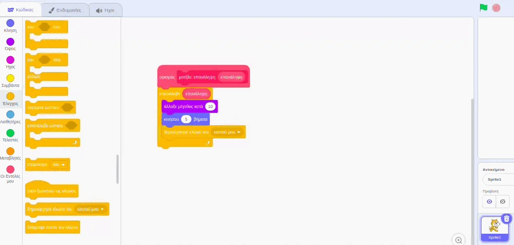
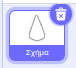
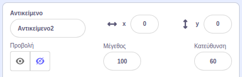
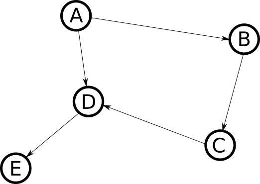

## Make a mandala

<div style="display: flex; flex-wrap: wrap">
<div style="flex-basis: 200px; flex-grow: 1; margin-right: 15px;">
Create more patterns to make a mandala!
</div>
<div>
{:width="300px"}
</div>
</div>

--- task ---

Right click on your `define pattern`{:class="block3myblocks"} block and choose **Edit** to add more parameters.



You can start by adding a `size`{:class="block3myblocks"} text label and a `size`{:class="block3myblocks"} input. Then, add a  `move`{:class="block3myblocks"} label and input, and use these parameters in the blocks below.



```blocks3
define pattern: repeat (repeat) size (size) move (move)
repeat (repeat)
change size by (size)
move (move) steps
create clone of (myself v)

when flag clicked
pattern: repeat (3) size (10) move (5)
```

--- /task ---

--- task ---

**Test:** See what your pattern looks like by clicking the green flag to run your program. It doesn't look like a mandala yet! Can you think of how you might make the pattern circular?

--- /task ---

To make your pattern circular and look even more like a mandala, add another input.

--- task ---

Add another input called `turn`{:class="block3myblocks"}. Then, as well as moving your clone, you can turn it as well.


```blocks3
define pattern: repeat (repeat) size (size) move (move) turn (turn)
repeat (repeat)
change size by (size)
move (move) steps
create clone of (myself v)
+ change size by ([0] - (size))
+ move ([0] - (move)) steps
+ turn right (turn) degrees
+ move (move) steps
+ create clone of (myself v)
+ move ([0] - (move)) steps
+ turn right (turn) degrees
end
```

--- /task ---

Mandalas are often complex — they can have many different rows that follow similar patterns. You can create a base pattern for the rest of the mandala rows to build on.

--- task ---

Try playing around with different numbers in your `pattern`{:class="block3myblocks"}. You can reset the position and size of your sprite anytime you like.



```blocks3
when flag clicked
pattern repeat (3) size (0) move (0) turn (60) ::custom
```

--- /task ---


Now that you have a basic pattern, you can use your `pattern`{:class="block3myblocks"} a number of times to make a repeating pattern, or mandala 'rows'. By using the same code over and over again, you make a program that has been **optimised**.

<p style="border-left: solid; border-width:10px; border-color: #0faeb0; background-color: aliceblue; padding: 10px;">
<span style="color: #0faeb0">**Optimisation**</span> means doing things in the most efficient way. Δες το παρακάτω διάγραμμα. You could get from A to E by following the path A-->B-->C-->D-->E. An optimisation would be to go A-->D-->E, which contains fewer steps and a shorter distance.

</p>

--- task ---

Beneath your `when flag clicked`{:class="block3events"} block, add in a few more **calls** to your `pattern`{:class="block3myblocks"}.


```blocks3
when flag clicked
pattern repeat (3) size (0) move (0) turn (60) ::custom
pattern repeat (6) size (10) move (45) turn (30) ::custom
pattern repeat (6) size (10) move (90) turn (30) ::custom
```

--- /task ---

--- task ---

**Test:** Click the green flag, and see what pattern is produced. You can change the numbers to experiment with patterns that you like, or even add in more calls to your `pattern`{:class="block3myblocks"}.

--- /task ---

--- save ---
