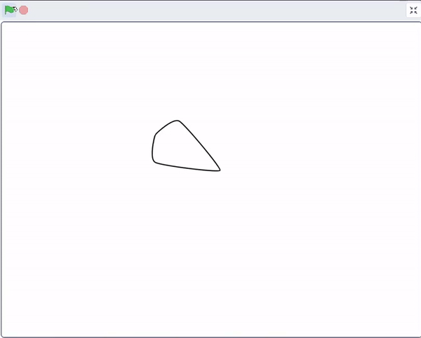

## Ρύθμισε το αντικείμενό σου

<div style="display: flex; flex-wrap: wrap">
<div style="flex-basis: 200px; flex-grow: 1; margin-right: 15px;">
Ρύθμισε το αντικείμενό σου για να επαναφέρεις το μάνταλά σου.
</div>
<div>
{:width="300px"}
</div>
</div>

Προς το παρόν, τα μάνταλα μοτίβα σου μπορεί να φαίνεται να αλλάζουν κάθε φορά, ανάλογα με τις τιμές των παραμέτρων που χρησιμοποιείς. Στη συνέχεια, θα δημιουργήσεις τη νέα `"εντολή μου"`{:class="block3myblocks"}, έτσι ώστε το αντικείμενο **μάνταλά** σου να ξεκινά πάντα στην ίδια κατάσταση.

--- task ---

Χρησιμοποίησε το μενού `Οι εντολές μου`{:class="block3myblocks"} για να δημιουργήσεις ένα νέο μπλοκ που ονομάζεται `ρύθμιση`{:class="block3myblocks"}. Η εντολή πρέπει να έχει τέσσερις παραμέτρους: `μέγεθος`{:class="block3myblocks"}, `φάντασμα`{:class="block3myblocks"}, `y`{:class="block3myblocks"}, και `κίνηση`{:class="block3myblocks"}. Μην ανησυχείς, μπορείς να τις αλλάξεις ή να προσθέσεις περισσότερες αργότερα.


```blocks3
define setup: μέγεθος (μέγεθος) φάντασμα (φάντασμα) y (y) μετακίνηση (μετακίνηση)
```

--- /task ---

Όταν χρωματίσεις το μάνταλα στο επόμενο βήμα, το μπλοκ `φάντασμα`{:class="block3myblocks"} θα κάνει τα χρώματα διαφανή έτσι όταν τα σχήματα επικαλύπτονται, θα αποκτήσεις ένα εφέ ανάμιξης χρωμάτων.

--- task ---

Τώρα πρόσθεσε μερικά μπλοκ για να ορίσεις την εμφάνιση και τη θέση του αντικειμένου σου.


```blocks3
define setup: μέγεθος (μέγεθος) φάντασμα (φάντασμα) y (y) μετακίνηση (move)
+ set size to (μέγεθος) %
+ set [φάντασμα v] effect to (φάντασμα)
+ go to x: (0) y: (0)
+ point in direction (90)
+ change y by (y)
+ move (μετακίνηση) steps
```

--- /task ---

--- task ---

Προς το παρόν, η `"εντολή μου"`{:class="block3myblocks"} δεν έχει χρησιμοποιηθεί, οπότε δεν θα υπάρξει καμία επίδραση στο μοτίβο σου. Πρόσθεσε κώδικα στην `ρύθμιση`{:class="block3myblocks"}, ώστε ο κώδικας να εκτελεστεί μόλις πατηθεί η σημαία.


```blocks3
when flag clicked
+ setup: μέγεθος (60) φάντασμα (50) y (10) μετακίνηση (10) ::custom
μοτίβο: επανάληψη (3) μέγεθος (10) μετακίνηση (5) στροφή (60) ::custom
μοτίβο: επανάληψη (5) μέγεθος (10) μετακίνηση (45) στροφή (30) ::custom
μοτίβο: επανάληψη (6) μέγεθος (10) μετακίνηση (90) στροφή (30) ::custom
```

--- /task ---

--- task ---

**Δοκίμασε** τον κώδικά σου κάνοντας κλικ στη σημαία και παρατηρώντας το μοτίβο που σχεδιάστηκε. Στη συνέχεια, άλλαξε τις τιμές των παραμέτρων μέχρι να έχεις ένα μοτίβο που σου αρέσει.

--- /task ---

--- task ---

Το αντικείμενο (όχι οι κλώνοι του) είναι ακόμα ορατό, μπορεί να κρυφτεί στο τέλος, αλλά θα πρέπει να εμφανιστεί στην αρχή.


```blocks3
when flag clicked
+ show
setup: μέγεθος (60) φάντασμα (50) y (10) μετακίνηση (10) ::custom
μοτίβο: επανάληψη (3) μέγεθος (10) μετακίνηση (5) στροφή (60) ::custom
μοτίβο: επανάληψη (5) μέγεθος (10) μετακίνηση (45) στροφή (30) ::custom
μοτίβο: επανάληψη (6) μέγεθος (10) μετακίνηση (90) στροφή (30) ::custom
+ hide
```

--- /task ---

--- save ---
