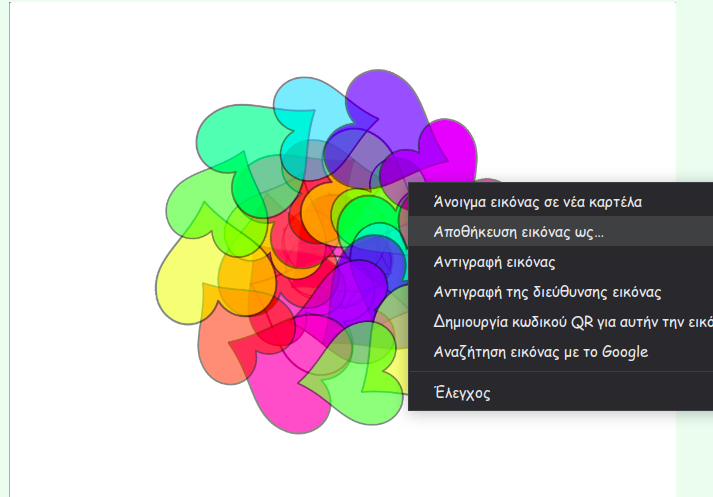

## Χρωματισμός Μάνταλα

<div style="display: flex; flex-wrap: wrap">
<div style="flex-basis: 200px; flex-grow: 1; margin-right: 15px;">
Η προσθήκη χρώματος σε μάνταλα είναι θεραπευτική καθώς και δημιουργική δραστηριότητα. Πρόσθεσε την ευκαιρία να χρωματίσεις διάφορα μέρη των μάνταλα.
</div>
<div>
{:width="300px"}
</div>
</div>

**Συμβουλή:** Αν θέλεις, μπορείς να εκτυπώσεις τα μαντάλα σου πριν προσθέσεις χρώμα σε αυτό το βήμα, και να το χρησιμοποιήσεις ως μοτίβο χρωματισμού για να το χρωματίσεις με το χέρι.

--- task ---

Ρίξε μια ματιά στις τρέχουσες ενδυμασίες για το αντικείμενο **σχήματός** σου. Θα δεις ότι υπάρχουν δύο ενδυμασίες, η μία λευκή και η άλλη γεμάτη.


--- /task ---

Για να προσθέσεις χρώμα στο μάνταλα, κάθε ένα από τα σχήματα κλώνου θα πρέπει να αλλάξει την `ενδυμασία`{:class="block3looks"} του και στη συνέχεια το `εφέ χρώματος`{:class="block3looks"} όταν πατηθεί ο κλώνος. Η νέα ενδυμασία θα είναι **μία** περισσότερη από ό, τι ήταν η προηγούμενη ενδυμασία, έτσι θα αλλάξει στη χρωματιστή έκδοση και στη συνέχεια στα διαφορετικά χρώματα.

--- task ---

Πρόσθεσε ένα μπλοκ `όταν αυτό το αντικείμενο πατηθεί`{:class="block3events"}, και στη συνέχεια χρησιμοποίησε τον τελεστή `+`{:class="block3operators"} για να αλλάξεις τον αριθμό ενδυμασίας.


```blocks3
when this sprite clicked
switch costume to ((answer) + (1))
```

--- /task ---

--- task ---

Πρόσθεσε ένα μπλοκ `εφέ αλλαγής χρώματος`{:class="block3looks"} σε αυτό το script, έτσι ώστε κάθε φορά που γίνεται κλικ στο αντικείμενο, το χρώμα να αλλάζει λίγο.


```blocks3
when this sprite clicked
switch costume to ((answer) + (1))
change [color v] effect by (25)
```

--- /task ---

Μπορεί να θυμηθείς ότι πρόσθεσες ένα μπλοκ εισόδου `φάντασμα`{:class="block3myblocks"} στο έργο σου στο προηγούμενο βήμα. Τώρα θα μπορείς να δεις τι συμβαίνει όταν αλλάζεις τον αριθμό που καλείς το `φάντασμα`{:class="block3myblocks"}.

--- task ---

Δημιούργησε το είδος του εφέ χρωματισμού που θέλεις αλλάζοντας τους αριθμούς του `φαντάσματος`{:class="block3myblocks"}. Ένας χαμηλότερος αριθμός στο `φάντασμα`{:class="block3myblocks"} σημαίνει ότι το χρώμα είναι πιο κορεσμένο, όπως ένας μόνιμος δείκτης. Ένας υψηλός αριθμός στο `φάντασμα`{:class="block3myblocks"} σημαίνει ότι το χρώμα είναι λιγότερο κορεσμένο, όπως οι υδατογραφίες.

--- /task ---

--- task ---

**Δοκιμή:** Κάνε κλικ στη σημαία, επίλεξε την ενδυμασία και στη συνέχεια προσπάθησε να κάνεις κλικ στους κλώνους για να αλλάξεις τα χρώματά τους.


Θα έχεις ένα εφέ καλειδοσκοπίου όταν τα χρώματα βρίσκονται σε στρώσεις το ένα επάνω στο άλλο.

--- /task ---

Αν σου αρέσει το μάνταλα που έχεις δημιουργήσει, τότε μπορείς να κάνεις **δεξί κλικ** στη σκηνή και να επιλέξεις να αποθηκεύσεις την εικόνα.



--- save ---
