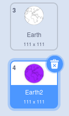

## Δημιουργία νέου μάνταλα

<div style="display: flex; flex-wrap: wrap">
<div style="flex-basis: 200px; flex-grow: 1; margin-right: 15px;">
Δημιούργησε ακόμη ένα μάνταλα εύκολα χρησιμοποιώντας τα βελτιστοποιημένα μπλοκ κώδικα.
</div>
<div>

</div>
</div>

Έχεις δύο ενδυμασίες που χρησιμοποιείς για να δημιουργήσεις το χρωματιστό μάνταλά σου. Πρόσθεσε μερικές ακόμη ενδυμασίες για να εξατομικεύσεις το μάνταλά σου ακόμα περισσότερο.

--- task ---

**Επιλογή:** Πρόσθεσε μια άλλη ενδυμασία. Εδώ επιλέχθηκε η ενδυμασία **Earth (Γη)**.


Δεν έχει σημασία ποια ενδυμασία θα επιλέξεις, αλλά θα πρέπει να βεβαιωθείς ότι είναι ενδυμασία **Διάνυσμα** και όχι ενδυμασία **Bitmap**. Μπορείς να πεις ότι έχεις επιλέξει μια ενδυμασία **Διάνυσμα**, καθώς θα δεις ένα κουμπί με ετικέτα **Μετατροπή σε Bitmap**. **Μην κάνεις κλικ σε αυτό το κουμπί**. Εάν έχεις επιλέξει μια ενδυμασία που είναι **Bitmap**, τότε διέγραψέ την και επίλεξε μια άλλη.


--- /task ---

--- task ---

Αφαίρεσε όλο το χρώμα από την ενδυμασία για να έχεις μόνο το περίγραμμα. Επίλεξε ολόκληρη την ενδυμασία και άλλαξε το **Γέμισμα** **Κορεσμός** σε `0` και το **Περίγραμμα** **Φωτεινότητα** σε `0`.


--- /task ---

--- task ---

Κάνε διπλασιασμό αυτής της ενδυμασίας, και στη συνέχεια επανάλαβε τη διαδικασία, αλλάζοντας αυτή τη φορά το χρώμα **Γέμισμα** σε ένα σκούρο χρώμα της επιλογής σου.



--- /task ---

--- task ---

Επανάλαβε αυτή τη διαδικασία μερικές ακόμη φορές με διαφορετικά διανυσματικά κοστούμια, για να αποκτήσεις διαφορετικά στυλ ενδυμασιών.


--- /task ---

Για να βεβαιωθείς ότι μπορείς να χρωματίσεις τα εξατομικευμένα μάνταλα, αναδιάταξε τις ενδυμασίες σου και έλεγε τις ρυθμίσεις ενδυμασίας στον σωστό αριθμό.

--- task ---

Αναδιέταξε τις ενδυμασίες σου, έτσι ώστε όλες αυτές που γεμίζουν με λευκό να είναι στην κορυφή, και αυτές που γεμίζουν με χρώματα να είναι χαμηλότερα προς τα κάτω, αλλά ακόμη στην ίδια σειρά.


--- /task ---

Θυμήσου να αλλάξεις σε ποια ενδυμασία αλλάζει το μάνταλα, ώστε να μπορείς να χρωματίσεις τα νέα μάνταλά σου. Στο παράδειγμα του έργου, υπάρχουν τέσσερα μάνταλα, έτσι αλλάξαμε τον αριθμό ενδυμασίας από '1' σε '4'


```blocks3
when this sprite clicked
+ switch costume to ((answer) + (4))
change [color v] effect by (25)
```

--- task ---

**Δοκιμή:** Άλλαξε σε μία από τις νέες σου ενδυμασίες και πάτησε την πράσινη σημαία για να δεις το μοτίβο που δημιουργείται.

--- /task ---

--- save ---
