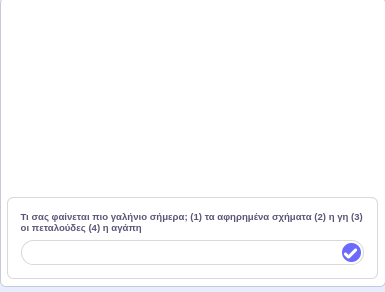

## Επίλεξε το μάνταλά σου

<div style="display: flex; flex-wrap: wrap">
<div style="flex-basis: 200px; flex-grow: 1; margin-right: 15px;">
Κάθε άνθρωπος είναι διαφορετικός. Δώσε στο άτομο που χρησιμοποιεί το πρόγραμμα μάνταλά σου μια επιλογή με βάση αυτό που βρίσκει πιο χαλαρωτικό.
</div>
<div>
{:width="300px"}
</div>
</div>

Τώρα θα πρέπει να έχεις τουλάχιστον δύο διαφορετικά μάνταλα. Μπορείς να χρησιμοποιήσεις ένα μπλοκ `ρώτησε`{:class="block3sensing"} για να δημιουργήσεις ένα μενού έναρξης, δίνοντας μια επιλογή σε όποιον χρησιμοποιεί το πρόγραμμα μαντάλα σου.

<p style="border-left: solid; border-width:10px; border-color: #0faeb0; background-color: aliceblue; padding: 10px;">
<span style="color: #0faeb0">**Τα μενού Έναρξης**</span> βρίσκονται συχνά σε παιχνίδια και εφαρμογές. Αφήνουν το άτομο που παίζει το παιχνίδι ή που χρησιμοποιεί την εφαρμογή να επιλέξει από μια σειρά από επιλογές, για παράδειγμα, τι χαρακτήρα θέλει να παίξει, ή ποιες ρυθμίσεις θέλει.
</p>

Δημιούργησε την ερώτηση που θα θέσεις στο μενού εκκίνησης.

--- task ---

Πρόσθεσε ένα μπλοκ `ρώτησε και περίμενε`{:class="block3sensing"} κάτω από το μπλοκ `όταν πατηθεί η σημαία`{:class="block3events"} και επίλεξε το κείμενο για την ερώτησή σου, όπως το παρακάτω παράδειγμα.


```blocks3
when flag clicked
+ hide
+ ask [Τι σου φαίνεται πιο γαλήνιο σήμερα; (1) αφηρημένα σχήματα (2) η γη (3) πεταλούδες (4) αγάπη] and wait
show
setup: size (60) ghost (50) y (10) move (10) ::custom
pattern: repeat (3) size (10) move (5) turn (60) ::custom
pattern: repeat (5) size (10) move (45) turn (30) ::custom
pattern: repeat (6) size (10) move (90) turn (30) ::custom
hide
```

--- /task ---

Ο λόγος για την απόκρυψη του αντικειμένου πριν από τη χρήση του `ρώτησε και περίμενε`{:class="block3sensing"} είναι έτσι ώστε η ερώτηση να εμφανίζεται στο κάτω μέρος της σκηνής, αντί ως σύννεφο ομιλίας από το αντικείμενο.



Αντιστοίχισε την απάντηση με το σωστό αντικείμενο για να εμφανιστεί το σωστό μάνταλα.

--- task ---

Πρόσθεσε ένα μπλοκ `άλλαξε ενδυμασία σε`{:class="block3looks"} ως `απάντηση`{:class="block3sensing"} κάτω από το μπλοκ `ρώτησε και περίμενε`{:class="block3sensing"}.


```blocks3
when flag clicked
hide
ask [Τι σου φαίνεται πιο γαλήνιο σήμερα; (1) αφηρημένα σχήματα (2) η γη (3) πεταλούδες (4) αγάπη] and wait
+ switch costume to (answer)
show
setup: (60) (50) (10) (10) ::custom
pattern: (3) (10) (5) (60) ::custom
pattern: (5) (10) (45) (30) ::custom
pattern: (6) (10) (90) (30) ::custom
hide
```

--- /task ---

--- task ---

**Δοκιμή**: Δοκίμασε το έργο μάνταλα κάνοντας κλικ στη σημαία και επιλέγοντας έναν αριθμό.

--- /task ---

--- save ---
