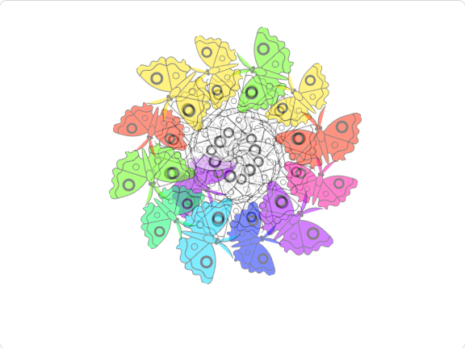

## Introduction

In this project, you will write a program that generates mandalas.

**Computer generated art** or **digital art**, is simply art that is made using a computer. It can range from creating drawings on a tablet, to writing Artificial Intelligence programs to enable a computer to create its own art. In this project, you are going to use programming in Scratch to create mindful artwork.

**Mandala** is a Sanskrit word that roughly means "circle". Manadalas are commonly circular designs that have repeating colors, shapes, and patterns. In Buddhist and Hindu traditions, mandalas are helpful in meditation. Creating mandalas is known to be a relaxing and mindful activity.

You will:
+ Use clones to create repeating patterns
+ Use `My Blocks`{:class='block3myblocks'} to optimise your computer generated art program
+ Use the `+`{:class='block3operators'} and `-`{:class='block3operators'} to change the appearance and position of a sprite

--- no-print ---

--- task ---
### Try it

  
Choose a shape and watch as the computer generates a mandala. You can colour in the shapes of the mandala by clicking on them (click more times for different colours), and then press the Spacebar

Can you see the pattern? How do you think Scratch creates that pattern?

Choose a different shape now and look at a new mandala. Does it look the same? Does it follow the same pattern?

<iframe src="https://scratch.mit.edu/projects/536953224/embed" allowtransparency="true" width="485" height="402" frameborder="0" scrolling="no" allowfullscreen></iframe>

--- /task ---

--- /no-print ---

--- print-only ---

--- /print-only ---
