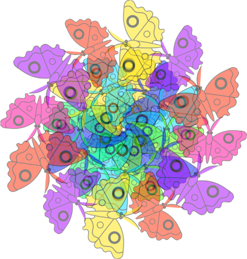

Create a program that generates colourful mandalas!

**Mandala** is a Sanskrit word that roughly means "circle". Manadalas are commonly circular designs that have repeating colours, shapes, and patterns. In Buddhist and Hindu traditions, mandalas are helpful in meditation. Creating mandalas is known to be a relaxing and mindful activity.

--- print-only ---

--- /print-only ---

--- no-print ---

--- /no-print ---
