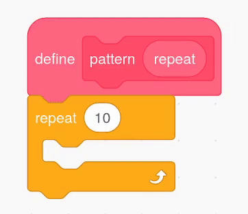

## Clone shapes to make a pattern

<div style="display: flex; flex-wrap: wrap">
<div style="flex-basis: 200px; flex-grow: 1; margin-right: 15px;">
Clone sprites to create a pattern.
</div>
<div>
{:width="300px"}
</div>
</div>

--- task ---

Open [the Scratch starter project](https://scratch.mit.edu/projects/540476254/){:target="_blank"}. Scratch will open in another browser tab. 

If you are working offline, you can download the [starter project](https://scratch.mit.edu/projects/540476254/){:target="_blank"}.

--- /task ---

--- task ---

Go to `My Blocks`{:class='block3myblocks'} and name your blocks (we have called it `pattern:`{:class="block3myblocks"}). Click **add a label** and call it `repeat`{:class="block3myblocks"}. Then click **Add an Input** to create the **parameter** called `repeat`{:class="block3myblocks"}.


```blocks3
define pattern: repeat (repeat)
```

--- /task ---

--- task ---

Drag the `repeat`{:class='block3myblocks'} parameter from `define pattern`{:class='block3myblocks'} into a `repeat`{:class='block3control'} loop block.




```blocks3
define pattern: repeat (repeat)
repeat (repeat)
```

--- /task ---


--- task ---

Add some code into the `repeat`{:class='block3myblocks'} loop of your `pattern`{:class='block3myblocks'}.


```blocks3
define pattern: repeat (repeat)
repeat (repeat)
+ change size by (10) //So you can see the clones
+ move (5) steps //So you can see the clones
+ create clone of (myself v)
```

--- /task ---


--- task ---

Get the `pattern`{:class='block3myblocks'} to `repeat`{:class='block3myblocks'} a number of times `when flag clicked`{:class='block3events'}. 


```blocks3
when flag clicked
show //Shape is displayed 
set size to (50) % //Not too big
go to x: (0) y: (0) //Displayed in the middle
pattern: repeat (3) ::custom
```

--- /task ---


--- task ---

**Test:** See what your pattern looks like by clicking the green flag to run your program.

--- /task ---

You should see the beginning of a mandala pattern. Adding more **parameters**, or requirements, to your pattern will create the first part of your mandala.

--- save ---
