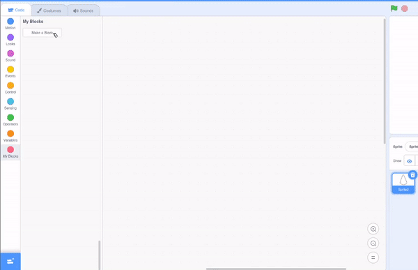

## Clone shapes to make a pattern

<div style="display: flex; flex-wrap: wrap">
<div style="flex-basis: 200px; flex-grow: 1; margin-right: 15px;">
Clone sprites to create a circular pattern.
</div>
<div>
{:width="300px"}
</div>
</div>

--- task ---

Open [the Scratch starter project](https://scratch.mit.edu/projects/540476254/){:target="_blank"}. Scratch will open in another browser tab. 

If you are working offline, you can download the starter project at [](https://rpf.io/p/en/puzzle-room). <mark>check links and change</mark>

--- /task ---

You should see a shape sprite that looks a little bit like a flower petal.

You will use **functions** (`my blocks`{:class="block3myblocks"}) to create a pattern with this shape. You may remember creating functions to organise your code in [Nature Rover](https://projects.raspberrypi.org/en/projects/nature-rover/3), and to repeat the same code in [Puzzle Room](https://projects.raspberrypi.org/en/projects/puzzle-room/4). Functions can also be used to optimise your programs/projects.

<p style="border-left: solid; border-width:10px; border-color: #0faeb0; background-color: aliceblue; padding: 10px;">
<span style="color: #0faeb0">**Optimisation**</span> means doing things in the most efficient way. Look at the diagram below. You could get from A to E by following the path A-->B-->C-->D-->E. An optimisation would be to go A-->D-->E, which contains less steps and a shorter distance.

</p>

--- task ---

Go to `My Blocks`{:class='block3myblocks'} and name your function (we have called it `pattern`{:class="block3myblocks"}). Click "Add an Input" to create your first pattern requirement, or **parameter** called `repeat`{:class="block3myblocks"}.




```blocks3
define pattern (repeat)
```

--- /task ---

To design how a pattern is made, the first step is to `define pattern`{:class='block3myblocks'}, adding blocks to get the code to repeat.

--- task ---

Add a `repeat`{:class='block3control'} block with a `repeat`{:class='block3myblocks'} parameter inside, by dragging the `repeat`{:class='block3myblocks'} parameter from `define pattern`{:class='block3myblocks'} into the `repeat`{:class='block3control'} loop block.


```blocks3
define pattern (repeat)
repeat (repeat)
```

--- /task ---

You will now use `clone`{:class='block3control'} blocks to make the same block appear as many times as it repeats. Make sure you also add code to get the sprite to change size and move, otherwise the sprites will be stacked on top of each other and you will not be able to see them.

--- task ---

Add some code into the `repeat`{:class='block3myblocks'} loop of your `pattern`{:class='block3myblocks'} function.


```blocks3
define pattern (repeat)
repeat (repeat)
+ change size by (10)
+ move (5) steps
+ create clone of (myself v)
```

--- /task ---

**Tip:** `Defining`{:class='block3myblocks'} the function makes a general pattern outline. What you are creating now with this function is similar to creating a spirograph stencil; it is the tool and the pattern is later created by using it. 

<mark>GIF of spirograph??</mark>

--- task ---

Create a pattern with your function. Get the `pattern`{:class='block3myblocks'} to `repeat`{:class='block3myblocks'} a number of times `when flag clicked`{:class='block3events'}. 


```blocks3
when flag clicked
pattern (3) ::custom
```

**Test:** See what your pattern looks like by clicking the green flag to run your program.

--- /task ---

<mark>shift to next step? Need to reword the titles etc.</mark>

You should see the beginning of a mandala pattern. Adding more **parameters**, or requirements, to your pattern function will create the first part of your mandala.


--- task ---

Right click on your `define pattern`{:class="block3myblocks"} block and choose **Edit** to add more parameters.


You can start by adding `size`{:class="block3myblocks"} and `move`{:class="block3myblocks"} and then use these parameters in the blocks below.


```blocks3
define pattern (repeat) (size) (move)
repeat (repeat)
change size by (size)
move (move) steps
create clone of (myself v)

when flag clicked
pattern (3) (10) (5)
```

--- /task ---

--- task ---

To create a more complicated patern, you can add another parameter to your function called `turn`{:class="block3myblocks"}. Then as well as moving your clone, you can turn it as well.


```blocks3
define pattern (repeat) (size) (move) (turn)
repeat (repeat)
change size by (size)
move (move) steps
create clone of (myself v)
+ change size by ([0] - (size))
+ move ([0] - (move)) steps
+ turn right (turn) degrees
+ move (move) steps
+ create clone of (myself v)
+ move ([0] - (move)) steps
+ turn right (turn) degrees
end

when flag clicked
pattern (3) (10) (5) (60)

```
--- /task ---

--- task ---

Try playing around with different numbers in your `pattern`{:class="block3myblocks"} function call. You can reset the position and size of your sprite anytime you like.


--- /task ---

--- save ---
