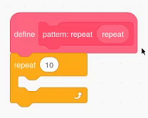

## Clone shapes to make a pattern

<div style="display: flex; flex-wrap: wrap">
<div style="flex-basis: 200px; flex-grow: 1; margin-right: 15px;">
Clone sprites to create a pattern.
</div>
<div>
{:width="300px"}
</div>
</div>

--- task ---

Open [the Scratch starter project](https://scratch.mit.edu/projects/540476254/){:target="_blank"}. Scratch will open in another browser tab. 

If you are working offline, you can download the [starter project](https://scratch.mit.edu/projects/540476254/).

--- /task ---

You should see a shape sprite that looks a bit like a flower petal.

You will use `my blocks`{:class="block3myblocks"} to create a pattern with this shape. You may remember creating `my blocks`{:class="block3myblocks"} to organise your code in [Nature Rover](https://projects.raspberrypi.org/en/projects/nature-rover/3), and to repeat the same code in [Puzzle Room](https://projects.raspberrypi.org/en/projects/puzzle-room/4). `My blocks`{:class="block3myblocks"} can also be used to reuse actions in a different way.

--- task ---

Go to `My Blocks`{:class='block3myblocks'} and name your blocks (we have called it `pattern:`{:class="block3myblocks"}). Add `repeat`{:class="block3myblocks"} as a label to identify the first input or what programmer call a **parameter**. Then click "Add an Input" to actually create the **parameter** called `repeat`{:class="block3myblocks"}.


```blocks3
define pattern: repeat (repeat)
```

--- /task ---

To design how a pattern is made, the first step is to `define pattern`{:class='block3myblocks'}.

--- task ---

Drag the `repeat`{:class='block3myblocks'} parameter from `define pattern`{:class='block3myblocks'} into a `repeat`{:class='block3control'} loop block.




```blocks3
define pattern: repeat (repeat)
repeat (repeat)
```

--- /task ---

You will now use `clone`{:class='block3control'} blocks to make the same block appear a number of times. Make sure you also add code to get the sprite to change size and move, otherwise the sprites will be stacked on top of each other and you will not be able to see them.

--- task ---

Add some code into the `repeat`{:class='block3myblocks'} loop of your `pattern`{:class='block3myblocks'}.


```blocks3
define pattern: repeat (repeat)
repeat (repeat)
+ change size by (10) // so you can see clones
+ move (5) steps // so you can see clones
+ create clone of (myself v)
```

--- /task ---

**Tip:** `Defining`{:class='block3myblocks'} makes a general pattern outline. What you are creating now with `my blocks`{:class="block3myblocks"} is similar to creating a spirograph stencil; it is the tool and the pattern is later created by using it. 

--- task ---

Create a pattern with your `my blocks`{:class="block3myblocks"}. Get the `pattern`{:class='block3myblocks'} to `repeat`{:class='block3myblocks'} a number of times `when flag clicked`{:class='block3events'}. 


```blocks3
when flag clicked
show // shape shows up 
set size to (50) % // not too big
go to x: (0) y: (0) // shows up in the middle
pattern: repeat (3) ::custom
```

**Test:** See what your pattern looks like by clicking the green flag to run your program.

--- /task ---

You should see the beginning of a mandala pattern. Adding more **parameters**, or requirements, to your pattern will create the first part of your mandala.

--- save ---
