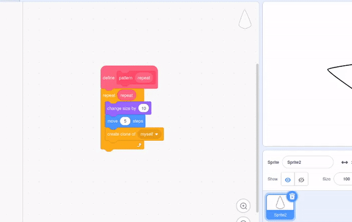
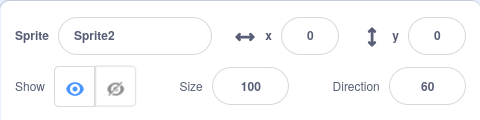

## Make a mandala

<div style="display: flex; flex-wrap: wrap">
<div style="flex-basis: 200px; flex-grow: 1; margin-right: 15px;">
Create more patterns to make a mandala!
</div>
<div>
{:width="300px"}
</div>
</div>

--- task ---

Right click on your `define pattern`{:class="block3myblocks"} block and choose **Edit** to add more parameters.



You can start by adding a `size`{:class="block3myblocks"} text label and a `size`{:class="block3myblocks"} input. Then add a  `move`{:class="block3myblocks"} label and input, use these parameters in the blocks below.


```blocks3
define pattern: repeat (repeat) size (size) move (move)
repeat (repeat)
change size by (size)
move (move) steps
create clone of (myself v)

when flag clicked
pattern: repeat (3) size (10) move (5)
```

--- /task ---

--- task ---

To create a more complicated patern, you can add another parameter to your function called `turn`{:class="block3myblocks"}. Then as well as moving your clone, you can turn it as well.


```blocks3
define pattern: repeat (repeat) size (size) move (move) turn (turn)
repeat (repeat)
change size by (size)
move (move) steps
create clone of (myself v)
+ change size by ([0] - (size))
+ move ([0] - (move)) steps
+ turn right (turn) degrees
+ move (move) steps
+ create clone of (myself v)
+ move ([0] - (move)) steps
+ turn right (turn) degrees
end

when flag clicked
pattern repeat (3) size (10) move (5) turn (60)

```
--- /task ---

--- task ---

Try playing around with different numbers in your `pattern`{:class="block3myblocks"} function call. You can reset the position and size of your sprite anytime you like.



--- /task ---

Now that you have a basic pattern you can use your `pattern`{:class="block3myblocks"} function a number of times, to make a repeating pattern. By using the same code over and over again, you are making a program that has been **optimised**.

<p style="border-left: solid; border-width:10px; border-color: #0faeb0; background-color: aliceblue; padding: 10px;">
<span style="color: #0faeb0">**Optimisation**</span> means doing things in the most efficient way. Look at the diagram below. You could get from A to E by following the path A-->B-->C-->D-->E. An optimisation would be to go A-->D-->E, which contains less steps and a shorter distance.

</p>

--- task ---

Beneath your `when flag clicked`{:class="block3events"} block, add in a few more **calls** to your `pattern`{:class="block3myblocks"} function.


```blocks3
when flag clicked
pattern repeat (3) size (10) move (5) turn (60) ::custom
pattern repeat (5) size (10) move (45) turn (30) ::custom
pattern repeat (6) size (10) move (90) turn (30) ::custom
```

--- /task ---

--- task ---

Click the green flag, and see what pattern is produced. You can change the numbers to experiment with patterns that you like, or even add in more calls to your `pattern`{:class="block3myblocks"} function.

--- /task ---

--- save ---
