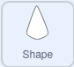

## Setup your sprite

<div style="display: flex; flex-wrap: wrap">
<div style="flex-basis: 200px; flex-grow: 1; margin-right: 15px;">
Set up your sprite to reset your Mandala.
</div>
<div>
{:width="300px"}
</div>
</div>

At the moment, your Mandala patterns may appear to change each time, depending on the parameter values you use. Next you will create a new function, so that your Mandala sprite always begins in the same state.

--- task -
Use the `My Blocks`{:class="block3myblocks"} menu to create a new block called `setup`{:class="block3myblocks"}. The block should have 4 parameters: `size`{:class="block3myblocks"}, `ghost`{:class="block3myblocks"}, `y`{:class="block3myblocks"} and `move`{:class="block3myblocks"}. Don't worry though, you can change these or add more later.


```blocks3
define setup (size) (ghost) (y) (move)
```

--- /task ---

--- task ---

Now add some blocks to your function, to set the appearance and position of your sprite.


```blocks3
define setup (size) (ghost) (y) (move)
+ set size to (size) %
+ set [ghost v] effect to (ghost)
+ go to x: (0) y: (0)
+ point in direction (90)
+ change y by (y)
+ move (move) steps
```

--- /task ---

--- task ---

At the moment, the function isn't called, so there will be no effect on your pattern. Add a call to the `setup`{:class="block3myblocks"} function, as soon as the flag is clicked.


```blocks3
when flag clicked
+ setup (60) (50) (10) (10) ::custom
pattern (3) (10) (5) (60) ::custom
pattern (5) (10) (45) (30) ::custom
pattern (6) (10) (90) (30) ::custom
```

--- /task ---

--- task ---

**Test** your code by clicking on the flag and observing the pattern that has been drawn, then change the values of the parameters until you have a pattern that you like.

--- /task ---

--- task ---

The sprite (not it's clones) is still visible, so it can be hidden at the end of the function calls.


```blocks3
when flag clicked
setup (60) (50) (10) (10) ::custom
pattern (3) (10) (5) (60) ::custom
pattern (5) (10) (45) (30) ::custom
pattern (6) (10) (90) (30) ::custom
hide
```

--- /task ---


--- save ---
