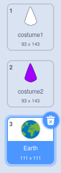

## Create another mandala

Create another mandala easily using your optimised code blocks.

--- task ---

Have a look at the current costumes for your **Shape** sprite. You will see that there are two costumes, one white and the other filled in.

--- /task ---

--- task ---

**Choose:** You can now add another costume. Here the **Earth** costume has been chosen.

It doesn't matter which costume you pick, but you should make sure that it is a **Vector** costume and not a **Bitmap** costume. You can tell you have chosen a **Vector** costume, as you will see a button labelled **Convert to Bitmap**. **Don't click this button**. If you have selected a costume that is a **Bitmap** then delete it and choose another one.

--- /task ---

--- task ---

Next you can remove all the colour from the costume. Select the whole costume and change the **Fill** **Saturation** to `0` and the **Outline** **Brightness** to `0`

--- /task ---

--- task ---

Duplicate this costume, and then repeat the process, this time changing the **Fill** colour to a dark colour of your choice.

--- /task ---

--- task ---

Repeat this process a few more times with different vector costumes, to give your self at least four different styles of costume.

--- /task ---

--- task ---

Switch to one of your new costumes and click the green flag to see the pattern that is generated.

--- /task ---

--- save ---
