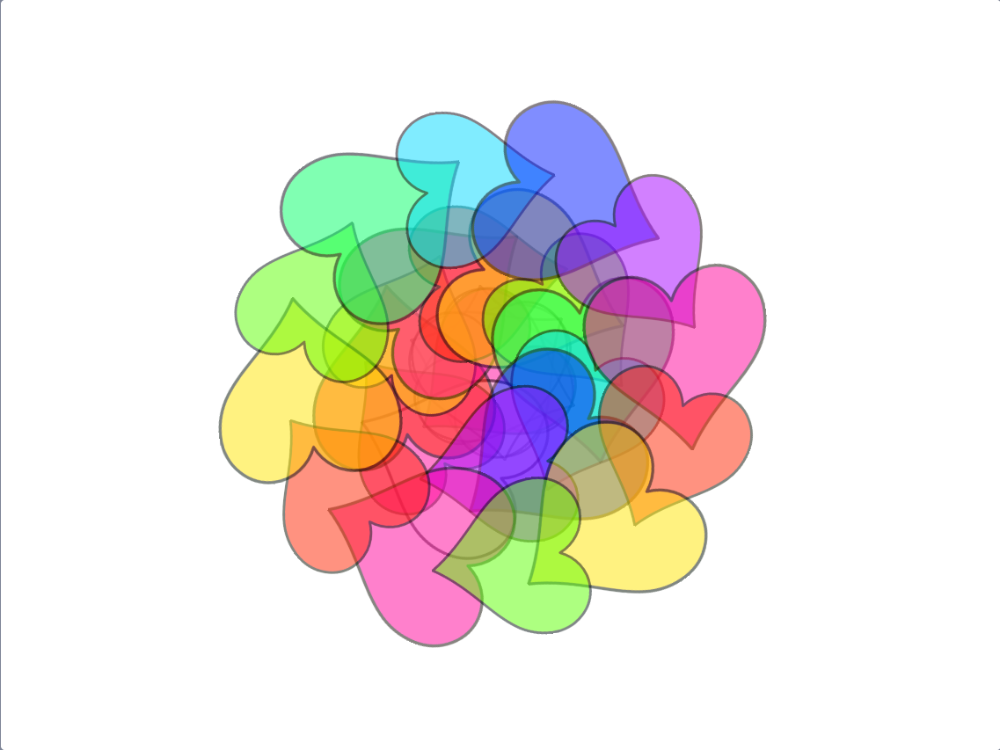

## Mandala colouring

<div style="display: flex; flex-wrap: wrap">
<div style="flex-basis: 200px; flex-grow: 1; margin-right: 15px;">
Adding colour to a mandala is therapeutic as well as a creative activity. Add in the opportunity to colour different parts of the mandalas.
</div>
<div>
{:width="300px"}
</div>
</div>

**Tip:** If you want to, you can print out your mandala before you colour it in this step, and use it as a colouring pattern to colour by hand.

--- task ---

Have a look at the current costumes for your **Shape** sprite. You will see that there are two costumes, one white and the other filled in.


--- /task ---

To add colour to your mandala, each of the clone shapes should change its `costume`{:class="block3looks"} and then its `color effect`{:class="block3looks"} when they are clicked on. The costume changed to will be **one** more than whatever the current costume is, so it changes to the coloured version.

--- task ---

Add a `when this sprite clicked`{:class="block3events"} block, and then use the `+`{:class="block3operators"} operator to change the costume number.


```blocks3
when this sprite clicked
switch costume to ((answer) + (1))
```

--- /task ---

--- task ---

Add a `change color effect`{:class="block3looks"} block to this script, so that each time the sprite is clicked, the colour changes a little.


```blocks3
when this sprite clicked
switch costume to ((answer) + (1))
change [color v] effect by (25)
```

--- /task ---

You might remember adding a `ghost`{:class="block3myblocks"} block parameter to your project in the last step. You should now be able to see what happens when you change the number where you call `ghost`{:class="block3myblocks"}.

--- task ---

Create the kind of colouring effect you want by changing your `ghost`{:class="block3myblocks"} numbers. A lower `ghost`{:class="block3myblocks"} number will mean the colour is more saturated, like a permanent marker. A nigh `ghost`{:class="block3myblocks"} number will mean the colour is less saturated, like watercolours.

--- /task ---

--- task ---

**Test:** Click the flag, choose your costume, and then try clicking on the clones to change their colours. 



You should get a kaleidoscope effect when colours are layered on top of each other.

--- /task ---

If you like the mandala you have created then you can **right-click** on the stage, and choose to save the image.


--- save ---
