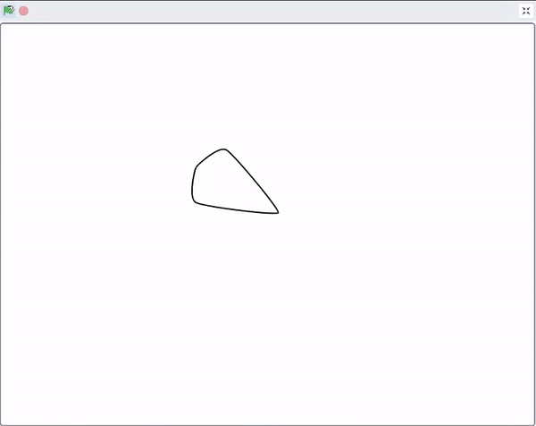

## Choose your mandala

<div style="display: flex; flex-wrap: wrap">
<div style="flex-basis: 200px; flex-grow: 1; margin-right: 15px;">
Everyone is different. Give the person using your mandala program a choice based on what they find most peaceful.
</div>
<div>
{:width="300px"}
</div>
</div>

You should now have at least two different mandalas. You can use an `ask`{:class="block3sensing} block to create a start menu, giving a choice to whoever is using your mandala program. 

<p style="border-left: solid; border-width:10px; border-color: #0faeb0; background-color: aliceblue; padding: 10px;">
<span style="color: #0faeb0">**Start menus**</span> are often found in games and apps. They let the person playing the game or using the app, pick from a number of options, for example, what character they want to play, or what settings they want.
</p>

--- task ---

Reorder your costumes, so that all the ones filled with white are at the top, and the ones filled with colours are lower down, but still in the same order.


--- /task ---

Create the question you will be asking in your start menu.

--- task ---

Add an `ask and wait`{:class="block3sensing} block beneath the `when flag clicked`{:class="block3events} and choose the text for your question, like the example below.


```blocks3
when flag clicked
+ hide
+ ask [What sounds most peaceful to you today? (1) abstract shapes (2) the earth (3) butterflies (4) love] and wait
show
setup (60) (50) (10) (10) ::custom
pattern (3) (10) (5) (60) ::custom
pattern (5) (10) (45) (30) ::custom
pattern (6) (10) (90) (30) ::custom
hide
```

--- /task ---

The reason for hiding the sprite before using the `ask and wait`{:class="block3sensing"} is so that the question appears at the bottom of the stage, rather than as a speach bubble from the sprite.


Match the answer with the right sprite to show the right mandala.

--- task ---

Add a `switch costume to`{:class="block3looks"} `answer`{:class="block3sensing"} block underneath the `ask and wait`{:class="block3sensing"} block. 


```blocks3
when flag clicked
hide
ask [What sounds most peaceful to you today? (1) abstract shapes (2) the earth (3) butterflies (4) love] and wait
+ switch costume to (answer)
show
setup (60) (50) (10) (10) ::custom
pattern (3) (10) (5) (60) ::custom
pattern (5) (10) (45) (30) ::custom
pattern (6) (10) (90) (30) ::custom
hide
```

--- /task ---


--- task ---

**Test**: Try your mandala project by clicking the flag and choosing a number.

--- /task ---


--- save ---
