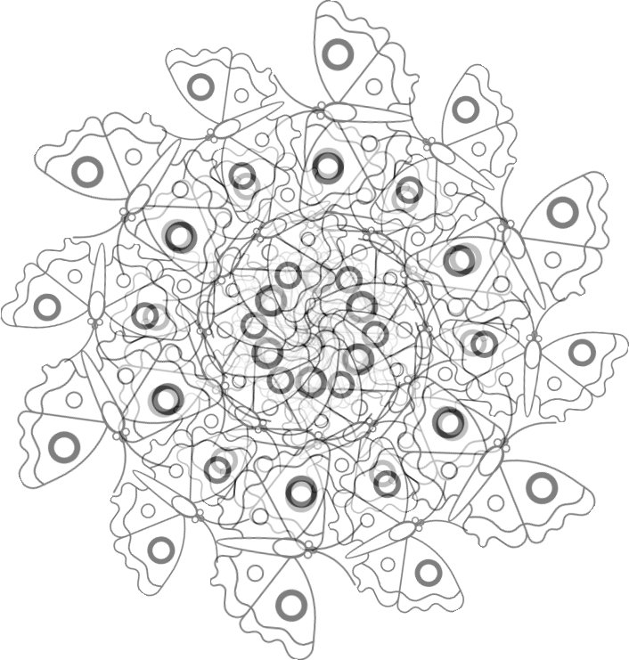
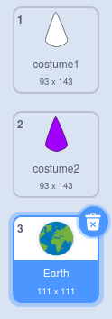

## Create another mandala

<div style="display: flex; flex-wrap: wrap">
<div style="flex-basis: 200px; flex-grow: 1; margin-right: 15px;">
Create another mandala easily using your optimised code blocks.
</div>
<div>

</div>
</div>

You have two costumes that you are using to create your coloured mandala. Add some more costumes to personalise your mandala even more.

--- task ---

**Choose:** Add another costume. Here the **Earth** costume has been chosen.



It doesn't matter which costume you pick, but you should make sure that it is a **Vector** costume and not a **Bitmap** costume. You can tell you have chosen a **Vector** costume, as you will see a button labelled **Convert to Bitmap**. **Do not click this button**. If you have selected a costume that is a **Bitmap**, then delete it and choose another one.


--- /task ---

--- task ---

Remove all the colour from the costume so you get just the outline. Select the whole costume and change the **Fill** **Saturation** to `0` and the **Outline** **Brightness** to `0`.


--- /task ---

--- task ---

Duplicate this costume, and then repeat the process, this time changing the **Fill** colour to a dark colour of your choice.


--- /task ---

--- task ---

Repeat this process a few more times with different vector costumes, to give yourself different styles of costume.


--- /task ---

To make sure you can colour your personalised mandalas, reorder your costumes and check the costume switches to the right number.

--- task ---

Reorder your costumes, so that all the ones filled with white are at the top, and the ones filled with colours are lower down, but still in the same order.


--- /task ---

Remember to change which costume the mandala switches to so that you can colour your new mandalas. In the example project, there are four mandalas so we changed the costume number from '1' to '4'


```blocks3
when this sprite clicked
+ switch costume to ((answer) + (4))
change [color v] effect by (25)
```

--- task ---

**Test:** Switch to one of your new costumes and click the green flag to see the pattern that is generated.

--- /task ---

--- save ---
