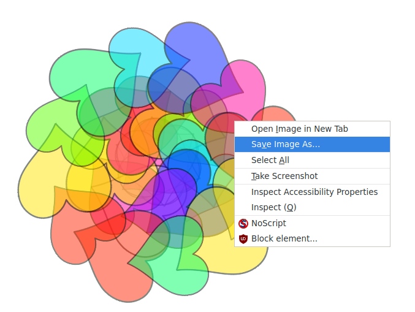

## Mandala colouring

<div style="display: flex; flex-wrap: wrap">
<div style="flex-basis: 200px; flex-grow: 1; margin-right: 15px;">
Adding colour to a mandala is therapeutic as well as a creative activity. Add in the opportunity to colour differnt parts of the mandalas.
</div>
<div>
{:width="300px"}
</div>
</div>

Each of the clones shapes should change it's `costume`{:class="block3looks"} and then it's `color effect`{:class="block3looks"} when they are clicked on. The costume changed to will be **four** more than whatever the current costume is, so it changes to the coloured version.

--- task ---

Add a `when this sprite clicked`{:class="block3events"} block, and then use the `+`{:class="block3operators"} operator to change the costume number.


```blocks3
when this sprite clicked
switch costume to ((answer) + (4))
```

--- /task ---

--- task ---

Add a `change color effect`{:class="block3looks"} block to this script, so that each time the sprite is clicked, the colour changes a little.


```blocks3
when this sprite clicked
switch costume to ((answer) + (4))
change [color v] effect by (25)
```

--- /task ---

--- task ---

**Test:** Click the flag, choose your costume and then try clicking on the clones to change their colours. See whether you can make a relaxing mandala.


--- /task ---

If you like the mandala you have created then you can **right-click** on the stage, and choose to save the image.



--- save ---
