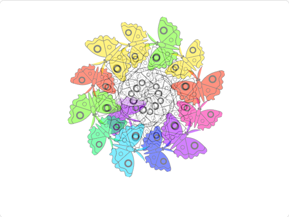

## Ce que tu feras

Crée un programme qui génère des mandalas.

**L'art généré par ordinateur** ou **l'art numérique** est simplement un art créé à l'aide d'un ordinateur. Il peut s'agir de dessins créés sur une tablette ou de l'écriture de programmes d'intelligence artificielle (IA) permettant à un ordinateur de créer sa propre œuvre. Dans ce projet, tu vas utiliser la programmation dans Scratch pour créer des œuvres de méditation.

**Mandala** est un mot sanskrit qui signifie grosso modo à « cercle ». Les mandalas sont généralement des dessins circulaires dont les couleurs, les formes et les motifs se répètent. Dans les traditions bouddhistes et hindoues, les mandalas sont utiles à la méditation. La création de mandalas est connue pour être une activité relaxante et reposante pour l'esprit.

Tu vas :
+ Utiliser des clones pour créer des formes qui se répètent
+ Utiliser `Mes Blocs`{:class='block3myblocks'} pour optimiser ton programme d'art généré par ordinateur
+ Utiliser les blocs opérateurs d'addition `+`{:class='block3operators'} et de soustraction `-`{:class='block3operators'} pour modifier l'apparence et la position d'un sprite

--- no-print ---

### Joue ▶️

--- task ---

  
Choisis une forme et regarde l'ordinateur générer le mandala. Tu peux colorier les formes du mandala en cliquant dessus (clique plusieurs fois pour différentes couleurs), puis appuie sur la <kbd>barre d'espace</kbd>.

Est-ce que tu vois la forme ? À ton avis, comment Scratch crée-t-il ce motif ?

Choisis une forme différente et regarde le nouveau mandala. Est-il pareil ? Est-ce qu'il suit le même motif ?

<iframe src="https://scratch.mit.edu/projects/536953224/embed" allowtransparency="true" width="485" height="402" frameborder="0" scrolling="no" allowfullscreen></iframe>

--- /task ---

--- /no-print ---

--- print-only ---

--- /print-only ---
