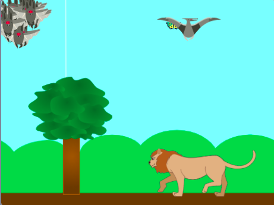

## Et ensuite ?

Si tu suis le parcours [Plus de Scratch](https://projects.raspberrypi.org/en/pathways/further-scratch), tu peux passer au projet [Essaims, bancs et nuées](https://projects.raspberrypi.org/en/projects/swarms-schools-flocks). Dans ce projet, tu vas faire un jeu qui utilise des clones pour créer une simulation d'un groupe d'animaux.

--- print-only ---

--- /print-only ---

--- no-print ---

  <iframe allowtransparency="true" width="485" height="402" src="https://scratch.mit.edu/projects/embed/546736449/?autostart=false" frameborder="0"></iframe>

--- /no-print ---

Si tu veux t'amuser davantage à explorer Scratch, tu peux essayer l'un de [ces projets](https://projects.raspberrypi.org/en/projects?software%5B%5D=scratch&curriculum%5B%5D=%201).
