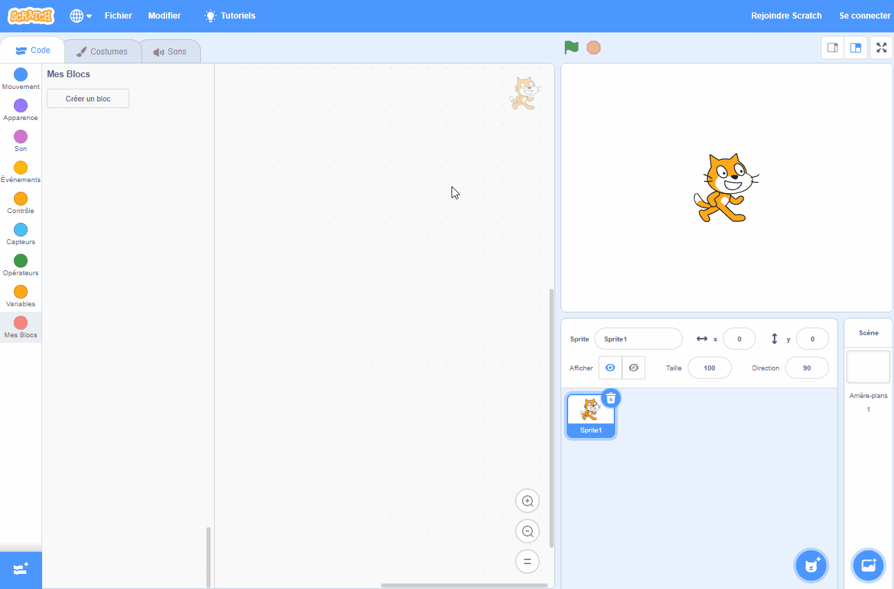
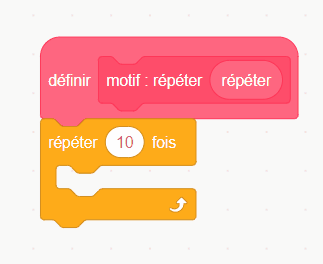

## Cloner des formes pour créer un motif

<div style="display: flex; flex-wrap: wrap">
<div style="flex-basis: 200px; flex-grow: 1; margin-right: 15px;">
Clone des sprites pour créer un motif.
</div>
<div>
{:width="300px"}
</div>
</div>

--- task ---

Ouvre le [projet de démarrage Scratch](https://scratch.mit.edu/projects/792850391/){:target="_blank"}. Scratch s'ouvrira dans un autre onglet du navigateur.

Si tu travailles hors ligne, tu peux télécharger le [projet de démarrage](https://scratch.mit.edu/projects/792850391/){:target="_blank"}.

--- /task ---

Tu devrais voir un sprite de forme qui ressemble un peu à un pétale de fleur.

Tu utiliseras `Mes Blocs`{:class="block3myblocks"} pour créer un motif avec cette forme. Tu te souviens d'avoir créé `Mes blocs`{:class="block3myblocks"} pour organiser ton code dans [Rover nature](https://projects.raspberrypi.org/fr-FR/projects/nature-rover/3){:target="_blank"}, et d'avoir répété le même code dans [Salle de puzzle](https://projects.raspberrypi.org/fr-FR/projects/puzzle-room/4){:target="_blank"} . `Mes Blocs`{:class="block3myblocks"} peut être utilisé pour réutiliser des actions d'une manière différente.

--- task ---

Va dans `Mes Blocs`{:class="block3myblocks"} et nomme tes blocs (nous l'avons appelé `motif :`{:class="block3myblocks"}). Ajoute `répéter`{:class="block3myblocks"} comme étiquette pour identifier la première entrée ou ce que les programmeurs appellent un **paramètre**. Clique ensuite sur « Ajouter une entrée » pour créer le **paramètre** appelé `répéter`{:class="block3myblocks"}.





```blocks3
define motif : répéter (répéter)
```

--- /task ---

Pour concevoir la façon dont un motif est réalisé, la première étape consiste à `définir le motif`{:class="block3myblocks"}.

--- task ---

Fais glisser le paramètre `répéter`{:class="block3myblocks"} de `définir motif`{:class='block3myblocks'} dans un bloc de boucle `répéter`{:class='block3control'}.




```blocks3
define motif : répéter (répéter)
repeat (répéter)
```

--- /task ---

Tu vas maintenant utiliser les blocs `cloner`{:class='block3control'} pour faire apparaître le même bloc plusieurs fois. Veille à ajouter également du code pour modifier la taille et la position du sprite, sinon les sprites seront empilés les uns sur les autres et tu ne pourras pas les voir.

--- task ---

Ajoute du code dans la boucle `répéter`{:class='block3myblocks'} de ton `motif`{:class='block3myblocks'}.


```blocks3
define motif : répéter (répéter)
repeat (répéter)
+ change size by (10) //Tu peux donc voir les clones
+ move (5) steps //Tu peux donc voir les clones
+ create clone of (myself v)
```

--- /task ---

**Astuce :** `Définir`{:class='block3myblocks'} crée un contour général du motif. Ce que tu crées maintenant avec `Mes Blocs`{:class="block3myblocks"} est similaire à la création d'un crayon de spirographe ; l'outil et le masque est créé plus tard en l'utilisant.


--- task ---

Crée un motif avec `Mes Blocs`{:class="block3myblocks"}. Fais en sorte que le `motif`{:class='block3myblocks'} se `répète`{:class='block3myblocks'} un certain nombre de fois `quand le drapeau est cliqué`{:class='block3events'}.


```blocks3
when flag clicked
show //La forme est affichée 
set size to (50) % //Pas trop grand
go to x: (0) y: (0) //Affiché au milieu
motif : répéter (3) ::custom
```

**Test :** Regarde à quoi ressemble ton motif en cliquant sur le drapeau vert pour exécuter ton programme.

--- /task ---

Tu devrais voir le début d'un motif de mandala. En ajoutant d'autres **paramètres**, ou exigences, à ton motif, tu créeras la première partie de ton mandala.

--- save ---
