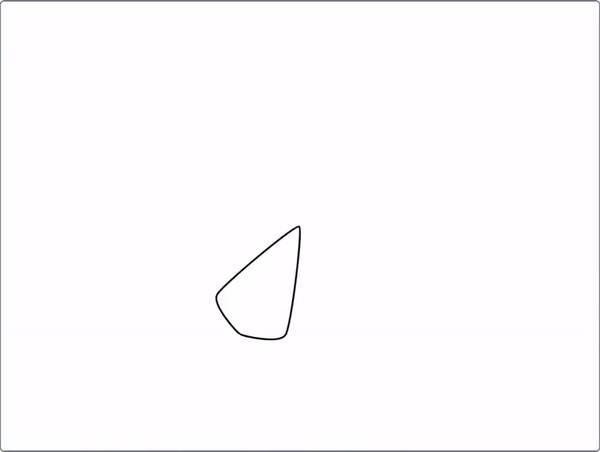

## Créer un mandala

<div style="display: flex; flex-wrap: wrap">
<div style="flex-basis: 200px; flex-grow: 1; margin-right: 15px;">
Crée plus de motifs pour créer un mandala !
</div>
<div>
{:width="300px"}
</div>
</div>

--- task ---

Fais un clic droit sur ton bloc `définir motif`{:class="block3myblocks"} et choisis **Modifier** pour ajouter plus de paramètres.


Tu peux commencer par ajouter une étiquette de texte `taille`{:class="block3myblocks"} et une entrée `taille`{:class="block3myblocks"}. Ensuite, ajoute une étiquette `déplacer`{:class="block3myblocks"} et une entrée, et utilise ces paramètres dans les blocs ci-dessous.


```blocks3
define motif : répéter (répéter) taille (taille) déplacer (déplacer)
repeat (répéter)
change size by (taille)
move (déplacer) steps
create clone of (myself v)

when flag clicked
motif : répéter (3) taille (10) déplacer (5) ::custom
```

--- /task ---

--- task ---

**Test :** Regarde à quoi ressemble ton motif en cliquant sur le drapeau vert pour exécuter ton programme. Ça ne ressemble pas encore à un mandala ! Peux-tu trouver un moyen pour rendre le motif circulaire ?

--- /task ---

Pour que ton motif soit circulaire et ressemble encore plus à un mandala, ajoute une autre entrée.

--- task ---

Ajoute une autre entrée appelée `tourner`{:class="block3myblocks"}. Ensuite, en plus de déplacer ton clone, tu peux aussi le tourner.


```blocks3
define motif : répéter (répéter) taille (taille) déplacer (déplacer) tourner (tourner)
repeat (répéter)
change size by (taille)
move (déplacer) steps
create clone of (myself v)
+ change size by ([0] - (taille))
+ move ([0] - (déplacer)) steps
+ turn right (tourner) degrees
+ move (déplacer) steps
+ create clone of (myself v)
+ move ([0] - (déplacer)) steps
+ turn right (tourner) degrees
end
```

--- /task ---

Les mandalas sont souvent complexes, ils peuvent avoir de nombreuses lignes différentes qui suivent des motifs similaires. Tu peux créer un motif de base sur lequel les autres lignes du mandala pourront s'appuyer.

--- task ---

Essaie différents chiffres dans ton `motif`{:class="block3myblocks"}. Tu peux réinitialiser la position et la taille de ton sprite quand tu le souhaites.


```blocks3
when flag clicked
motif répéter (3) taille (0) déplacer (0) tourner (60) ::custom
```

--- /task ---


Maintenant que tu as un motif de base, tu peux utiliser ton `motif`{:class="block3myblocks"} un certain nombre de fois pour créer un motif qui se répète, ou des « lignes » de mandala. En utilisant le même code encore et encore, tu crées un programme qui a été **optimisé**.

<p style="border-left: solid; border-width:10px; border-color: #0faeb0; background-color: aliceblue; padding: 10px;">
<span style="color: #0faeb0">**Optimisation**</span> signifie faire les choses de la manière la plus efficace. Regarde le schéma ci-dessous. Tu pourrais aller de A à E en suivant le chemin A-->B-->C-->D-->E. Une optimisation serait d'aller A-->D-->E, qui contient moins d'étapes et une distance plus courte.

</p>

--- task ---

Sous ton bloc `quand le drapeau est cliqué`{:class="block3events"}, ajoute quelques **appels** supplémentaires à ton `motif`{:class="block3myblocks"}.


```blocks3
when flag clicked
motif répéter (3) taille (0) déplacer (0) tourner (60) ::custom
motif répéter (6) taille (10) déplacer (45) tourner (30) ::custom
motif répéter (6) taille (10) déplacer (90) tourner (30) ::custom
```

--- /task ---

--- task ---

**Test :** Clique sur le drapeau vert, et vois quel motif est produit. Tu peux modifier les nombres pour expérimenter les motifs qui te plaisent, ou même ajouter d'autres appels à ton `motif`{:class="block3myblocks"}.

--- /task ---

--- save ---
