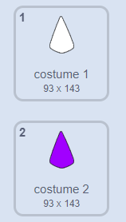

## Colorisation du mandala

<div style="display: flex; flex-wrap: wrap">
<div style="flex-basis: 200px; flex-grow: 1; margin-right: 15px;">
Ajouter de la couleur à un mandala est à la fois une activité thérapeutique et créative. Ajoute la possibilité de colorier différentes parties des mandalas.
</div>
<div>
{:width="300px"}
</div>
</div>

**Astuce :** Si tu veux, tu peux imprimer ton mandala avant d'y ajouter de la couleur à cette étape, et l'utiliser comme motif à colorier à la main.

--- task ---

Jette un œil aux costumes actuels pour ton sprite **forme**. Tu verras qu'il y a deux costumes, l'un blanc et l'autre rempli.



--- /task ---

Pour ajouter de la couleur à ton mandala, chacune des formes clones doit changer son `costume`{:class="block3looks"} puis son `effet de couleur`{:class="block3looks"} lorsque le clone est cliqué. Le nouveau costume sera **un** de plus que le précédent, il passera donc à la version colorée, puis aux différentes couleurs.

--- task ---

Ajoute un bloc `quand ce sprite est cliqué`{:class="block3events"}, puis utilise l'opérateur `+`{:class="block3operators"} pour modifier le numéro du costume.


```blocks3
when this sprite clicked
switch costume to ((answer) + (1))
```

--- /task ---

--- task ---

Ajoute un bloc `mettre l'effet couleur`{:class="block3looks"} à ce script, de sorte qu'à chaque fois qu'un sprite est cliqué, la couleur change un peu.


```blocks3
when this sprite clicked
switch costume to ((answer) + (1))
change [color v] effect by (25)
```

--- /task ---

Tu te souviens peut-être que dans la dernière étape, tu as ajouté une entrée de bloc `fantôme`{:class="block3myblocks"} à ton projet. Tu devrais maintenant pouvoir voir ce qui se passe lorsque tu changes le numéro où tu appelles `fantôme`{:class="block3myblocks"}.

--- task ---

Crée le type d'effet de coloration que tu veux en changeant tes nombres `fantôme`{:class="block3myblocks"}. Un nombre `fantôme`{:class="block3myblocks"} plus petit signifie que la couleur est plus saturée, comme un indélébile. Un nombre `fantôme`{:class="block3myblocks"} plus élevé signifie que la couleur est moins saturée, comme les aquarelles.

--- /task ---

--- task ---

**Test :** Clique sur le drapeau, choisis ton costume, puis essaie de cliquer sur les clones pour changer leurs couleurs.


Tu devrais obtenir un effet kaléidoscope lorsque les couleurs sont superposées.

--- /task ---

Si tu aimes le mandala que tu as créé, tu peux faire un **clic droit** sur la scène, et choisir d'enregistrer l'image.


--- save ---
