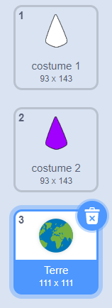
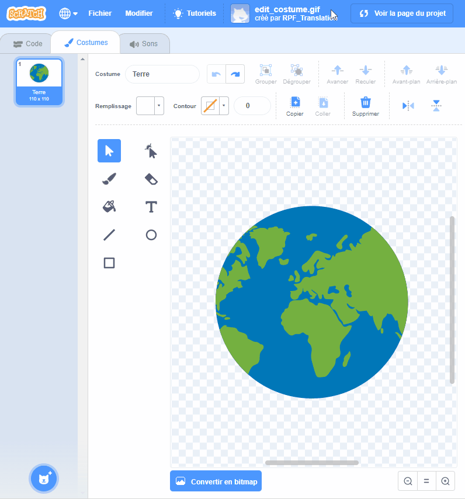
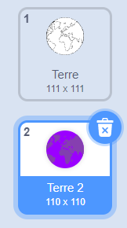
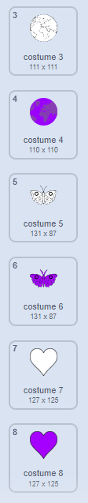
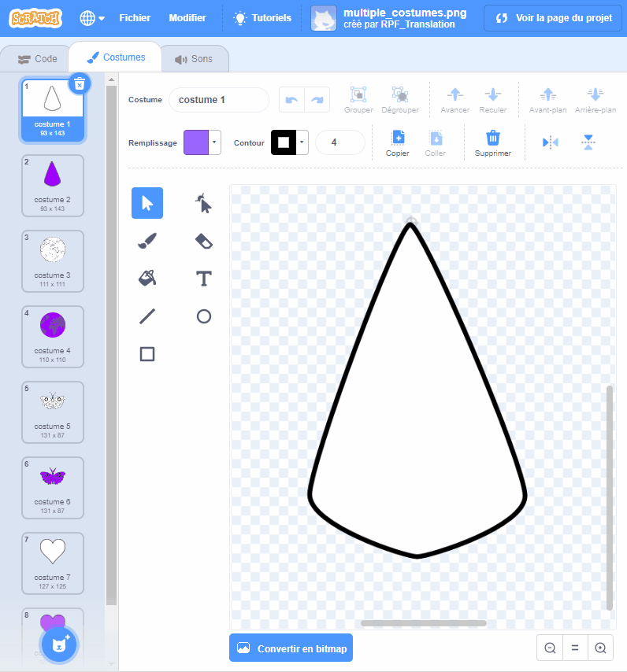

## Créer un autre mandala

<div style="display: flex; flex-wrap: wrap">
<div style="flex-basis: 200px; flex-grow: 1; margin-right: 15px;">
Crée un autre mandala facilement en utilisant tes blocs de code optimisés.
</div>
<div>

</div>
</div>

Tu as deux costumes que tu utilises pour créer ton mandala coloré. Ajoute d'autres costumes pour personnaliser encore plus ton mandala.

--- task ---

**Choisir :** Ajouter un autre costume. Ici, le costume **Terre** a été choisi.



Le costume que tu choisis n'a pas d'importance, mais tu dois t'assurer que c'est un costume **Vectoriel** et non un costume **Bitmap**. Tu pourras savoir si tu as choisi un costume **Vectoriel**, car tu verras un bouton intitulé **Convertir en bitmap**. **Ne clique pas sur ce bouton**. Si tu as sélectionné un costume qui est un **Bitmap**, alors supprime-le et choisis-en un autre.


--- /task ---

--- task ---

Enlève toute la couleur du costume pour n'obtenir que le contour. Sélectionne l'ensemble du costume et modifie le **Remplissage** **Saturation** à `0` et le **Contour** **Luminosité** à `0`.



--- /task ---

--- task ---

Duplique ce costume, puis répète le processus, en changeant cette fois la couleur **Remplissage** par une couleur sombre de ton choix.



--- /task ---

--- task ---

Répète ce processus plusieurs fois avec différents costumes vectoriels, pour avoir différents styles de costumes.



--- /task ---

Pour être sûr de pouvoir colorier tes mandalas personnalisés, réorganise à nouveau tes costumes et vérifie que le costume se place sur le bon numéro.

--- task ---

Réorganise tes costumes, de sorte que tous ceux qui sont remplis de blanc soient en haut, et que ceux qui sont remplis de couleurs soient plus bas, mais toujours dans le même ordre.



--- /task ---

N'oublie pas de changer le costume du mandala pour que tu puisses colorier tes nouveaux mandalas. Dans l'exemple du projet, il y a quatre mandalas, nous avons donc changé le numéro du costume de « 1 » à « 4 »


```blocks3
when this sprite clicked
+ switch costume to ((answer) + (4))
change [color v] effect by (25)
```

--- task ---

**Test :** Passe à l'un de tes nouveaux costumes et clique sur le drapeau vert pour voir le motif qui est généré.

--- /task ---

--- save ---
