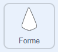
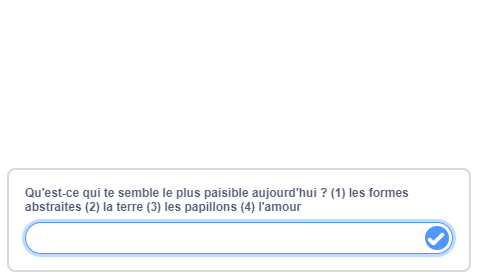

## Choisir ton mandala

<div style="display: flex; flex-wrap: wrap">
<div style="flex-basis: 200px; flex-grow: 1; margin-right: 15px;">
Tout le monde est différent. Donne à l'utilisateur de ton programme de mandala le choix de créer son propre mandala.
</div>
<div>
{:width="300px"}
</div>
</div>

Tu devrais maintenant avoir au moins deux mandalas différents. Tu peux utiliser un bloc `demander`{:class="block3sensing"} pour créer un menu de démarrage qui offre un choix à ton utilisateur.

<p style="border-left: solid; border-width:10px; border-color: #0faeb0; background-color: aliceblue; padding: 10px;">
<span style="color: #0faeb0">**Les menus de démarrage**</span> se trouvent souvent dans les jeux et les applis. Ils permettent à la personne qui joue au jeu ou qui utilise l'application de choisir parmi un certain nombre d'options, par exemple le personnage qu'elle veut incarner ou les paramètres qu'elle souhaite.
</p>

Crée la question que tu poseras dans ton menu de démarrage.

--- task ---

Ajoute un bloc `demander et attendre`{:class="block3sensing"} sous `quand le drapeau est cliqué`{:class="block3events"} et choisis le texte de ta question, comme l'exemple ci-dessous.



```blocks3
when flag clicked
+ hide
+ ask [Qu'est-ce qui te semble le plus paisible aujourd'hui ? (1) les formes abstraites (2) la terre (3) les papillons (4) l'amour] and wait
show
configuration : taille (60) fantôme (50) y (10) déplacer (10) ::custom
motif : répéter (3) taille (10) déplacer (5) turn (60) ::custom
motif : répéter (5) taille (10) déplacer (45) turn (30) ::custom
motif : répéter (6) taille (10) déplacer (90) turn (30) ::custom
hide
```

--- /task ---

Tu dois cacher le sprite avant d'utiliser le bloc `demander et attendre`{:class="block3sensing"} parce que la question apparaît au bas de la scène, plutôt que sous forme de bulle de texte du sprite.



Fais correspondre la réponse avec le bon sprite pour afficher le bon mandala.

--- task ---

Ajoute un bloc `basculer sur le costume`{:class="block3looks"} `demander`{:class="block3sensing"} sous le bloc `demander et attendre`{:class="block3sensing"}.


```blocks3
when flag clicked
hide
ask [Qu'est-ce qui te semble le plus paisible aujourd'hui ? (1) les formes abstraites (2) la terre (3) les papillons (4) l'amour] and wait
+ switch costume to (answer)
show
configuration : (60) (50) (10) (10) ::custom
motif : (3) (10) (5) (60) ::custom
motif : (5) (10) (45) (30) ::custom
motif : (6) (10) (90) (30) ::custom
hide
```

--- /task ---

--- task ---

**Test** : Essaie ton projet mandala en cliquant sur le drapeau et en choisissant un nombre.

--- /task ---

--- save ---
