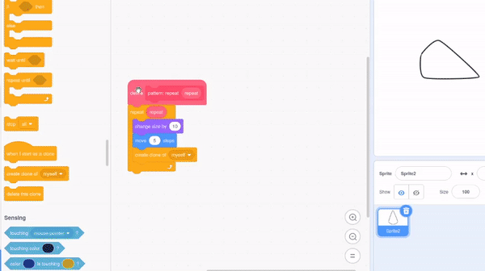

## एक मंडला बनाओ

<div style="display: flex; flex-wrap: wrap">
<div style="flex-basis: 200px; flex-grow: 1; margin-right: 15px;">
मंडला बनाने के लिए और पैटर्न बनाएं!
</div>
<div>
{:width="300px"}
</div>
</div>

--- task ---

`define pattern`{:class="block3myblocks"} ब्लॉक पर राइट क्लिक करें और अधिक पैरामीटर जोड़ने के लिए **Edit** चुनें ।



`size`{:class="block3myblocks"}टेक्स्ट लेबल और `size`{:class="block3myblocks"} इनपुट जोड़कर प्रारंभ कर सकते हैं। फिर, एक  `move`{:class="block3myblocks"}  लेबल और इनपुट जोड़ें, और नीचे दिए गए ब्लॉक में इन पैरामीटर  का उपयोग करें।


```blocks3
define pattern: repeat (repeat) size (size) move (move)
repeat (repeat)
change size by (size)
move (move) steps
create clone of (myself v)

when flag clicked
pattern: repeat (3) size (10) move (5)
```

--- /task ---

--- task ---

**परिक्षण:** अपने प्रोग्राम को चलाने के लिए हरे झंडे पर क्लिक करके देखें कि आपका पैटर्न कैसा दिखता है। यह अभी तक एक मंडला की तरह नहीं दिखता है! क्या आप सोच सकते हैं कि आप पैटर्न को वृत्ताकार कैसे बना सकते हैं?

--- /task ---

अपने पैटर्न को गोलाकार बनाने और मंडला की तरह दिखने के लिए, एक और इनपुट जोड़ें।

--- task ---

`turn`{:class="block3myblocks"} नामक एक अन्य इनपुट जोड़ें। फिर, अपने क्लोन को हिलाने के साथ-साथ, आप उसे घुमा भी सकते हैं।


```blocks3
define pattern: repeat (repeat) size (size) move (move) turn (turn)
repeat (repeat)
change size by (size)
move (move) steps
create clone of (myself v)
+ change size by ([0] - (size))
+ move ([0] - (move)) steps
+ turn right (turn) degrees
+ move (move) steps
+ create clone of (myself v)
+ move ([0] - (move)) steps
+ turn right (turn) degrees
end
```

--- /task ---

मंडला अक्सर जटिल होते हैं - उनकी कई अलग-अलग पंक्तियाँ हो सकती हैं जो समान पैटर्न का पालन करती हैं। आप मंडला की बाकी पंक्तियों के निर्माण के लिए एक आधार पैटर्न बना सकते हैं।

--- task ---

`pattern`{:class="block3myblocks"} "में विभिन्न संख्याओं के साथ खेलने का प्रयास करें। आप जब चाहें अपने स्प्राइट की स्थिति और आकार को रीसेट कर सकते हैं।


```blocks3
when flag clicked
pattern repeat (3) size (0) move (0) turn (60) ::custom
```

--- /task ---


अब जब आपके पास एक बुनियादी पैटर्न है, तो आप अपने `pattern`{:class="block3myblocks"} का उपयोग दोहराए जाने वाले पैटर्न, या मंडला 'पंक्तियों' को बनाने के लिए कई बार कर सकते हैं। एक ही कोड को बार-बार इस्तेमाल करने से आप एक ऐसा प्रोग्राम बनाते हैं जिसे **अनुकूलित** किया गया है ।

<p style="border-left: solid; border-width:10px; border-color: #0faeb0; background-color: aliceblue; padding: 10px;">
<span style="color: #0faeb0">**इष्टतमीकरण**</span> अर्थ है चीजों को सबसे कुशल तरीके से करना। नीचे दिए गए आरेख को देखें। आप पथ A-->B-->C-->D-->E का अनुसरण करके A से E तक जा सकते हैं। एक अनुकूलन A -> D -> E से जाना होगा, जिसमें कम कदम और कम दूरी होती है।

</p>

--- task ---

अपने `when flag clicked`{:class="block3events"} ब्लॉक के नीचे कुछ और **calls** to your `pattern`{:class="block3myblocks"} जोड़ें ।


```blocks3
when flag clicked
pattern repeat (3) size (0) move (0) turn (60) ::custom
pattern repeat (6) size (10) move (45) turn (30) ::custom
pattern repeat (6) size (10) move (90) turn (30) ::custom
```

--- /task ---

--- task ---

**परिक्षण:** हरे झंडे पर क्लिक करें, और देखें कि कौन सा पैटर्न तैयार किया गया है। आप अपनी पसंद के पैटर्न के साथ प्रयोग करने के लिए नंबर बदल सकते हैं, या अपने `pattern`{:class="block3myblocks"} में और कॉल भी जोड़ सकते हैं।

--- /task ---

--- save ---
