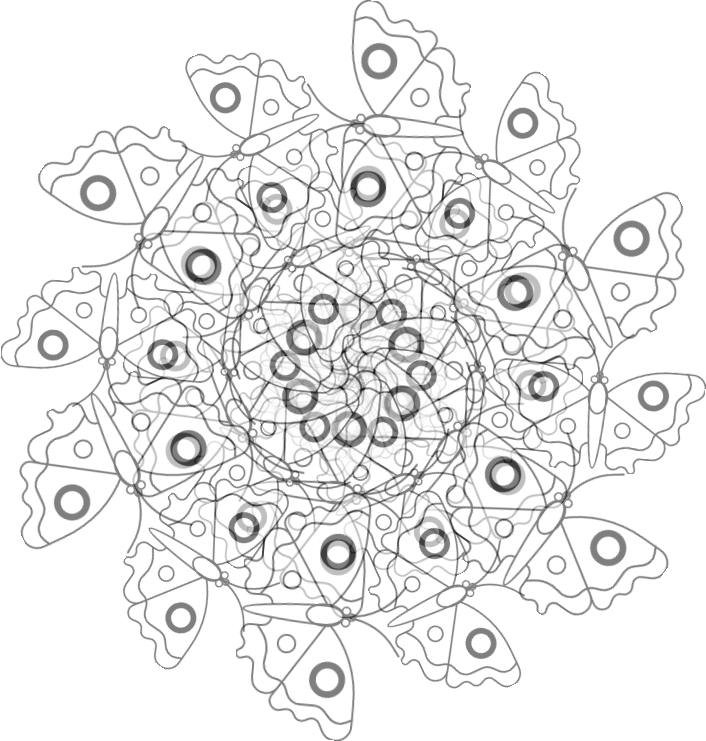
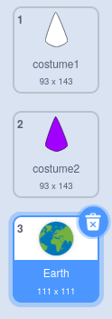
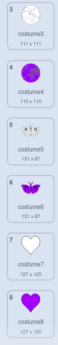

## एक और मंडला बनाएं

<div style="display: flex; flex-wrap: wrap">
<div style="flex-basis: 200px; flex-grow: 1; margin-right: 15px;">
अपने अनुकूलित कोड ब्लॉक का उपयोग करके आसानी से एक और मंडला बनाएं।
</div>
<div>

</div>
</div>

आपके पास दो पोशाकें हैं जिनका उपयोग आप अपना रंगीन मंडला बनाने के लिए कर रहे हैं। अपने मंडला को और भी अधिक वैयक्तिकृत करने के लिए कुछ और पोशाकें जोड़ें।

--- task ---

**चुनें:** एक और पोशाक जोड़ें। यहां **Earth** पोशाक को चुना गया है।



इससे कोई फर्क नहीं पड़ता कि आप कौन सी पोशाक चुनते हैं, लेकिन आपको यह सुनिश्चित करना चाहिए कि यह **Vector** पोशाक है न कि **Bitmap** पोशाक। आप बता सकते हैं कि आपने  **Vector**  पोशाक  चुनी है  जैसे  ही  आपको  **Convert to Bitmap** लेबल वाला एक बटन दिखाई देगा। **इस बटन को क्लिक न करें**. यदि आपने एक पोशाक का चयन किया है जो कि **Bitmap**, है तो उसे हटा दें और दूसरी चुनें।


--- /task ---

--- task ---

पोशाक से सभी रंग हटा दें ताकि आपको केवल रूपरेखा मिल सके। संपूर्ण पोशाक का चयन करें और **Fill** **Saturation** को `0` में बदलें और **Outline** **Brightness** को `0` में।


--- /task ---

--- task ---

इस पोशाक की नकल करें, और फिर इस प्रक्रिया को दोहराएं, इस बार **Fill** रंग को अपनी पसंद के गहरे रंग में बदलें।


--- /task ---

--- task ---

अपने आप को विभिन्न शैलियों की पोशाक देने के लिए, विभिन्न वेक्टर परिधानों के साथ इस प्रक्रिया को कुछ और बार दोहराएं।



--- /task ---

यह सुनिश्चित करने के लिए कि आप अपने व्यक्तिगत मंडलों को रंग सकते हैं, अपनी पोशाक को पुन: व्यवस्थित कर सकते हैं और पोशाक स्विच को सही संख्या में जांच सकते हैं।

--- task ---

अपनी पोशाक को फिर से व्यवस्थित करें, ताकि सभी सफेद रंग से भरे हुए शीर्ष पर हों, और जो रंगों से भरे हुए हैं वे नीचे हैं, लेकिन फिर भी उसी क्रम में हों।


--- /task ---

मंडला किस पोशाक में बदलता है करना याद रखें ताकि आप अपने नए मंडलों को रंग सकें। उदाहरण प्रोजेक्ट में, चार मंडला हैं इसलिए हमने पोशाक संख्या को '1' से बदलकर '4' कर दिया है।


```blocks3
when this sprite clicked
+ switch costume to ((answer) + (4))
change [color v] effect by (25)
```

--- task ---

**परिक्षण:** अपने नए परिधानों में से एक पर स्विच करें और उत्पन्न होने वाले पैटर्न को देखने के लिए हरे झंडे पर क्लिक करें।

--- /task ---

--- save ---
