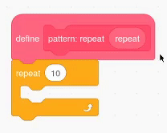

## ವಿನ್ಯಾಸವನ್ನು ಮಾಡಲು ತದ್ರೂಪದ ಆಕಾರಗಳು

<div style="display: flex; flex-wrap: wrap">
<div style="flex-basis: 200px; flex-grow: 1; margin-right: 15px;">
ವಿನ್ಯಾಸವನ್ನು ರಚಿಸಲು ಕ್ಲೋನ್‌ ಸ್ಪ್ರೈಟ್‌ಗಳು.
</div>
<div>
{:width="300px"}
</div>
</div>

--- task ---

[ Scratch ಪ್ರಾರಂಭಿಕ ಪ್ರಾಜೆಕ್ಟ್](https://scratch.mit.edu/projects/540476254/){:target="_blank"} ತೆರೆಯಿರಿ. Scratch ಇನ್ನೊಂದು ಬ್ರೌಸರ್ ಟ್ಯಾಬ್‌ನಲ್ಲಿ ತೆರೆಯುತ್ತದೆ.

ನೀವು ಆಫ್‌ಲೈನ್‌ನಲ್ಲಿ ಕೆಲಸ ಮಾಡುತ್ತಿದ್ದರೆ, [ಪ್ರಾರಂಭಿಕ ಪ್ರಾಜೆಕ್ಟ್](https://scratch.mit.edu/projects/540476254/){:target="_blank"} ಡೌನ್‌ಲೋಡ್‌ ಮಾಡಿಕೊಳ್ಳಿ.

--- /task ---

ನೀವು ಸ್ವಲ್ಪ ಹೂವಿನ ದಳದಂತೆ ಕಾಣುವ ಆಕಾರ ಸ್ಪ್ರೈಟ್‌ನ್ನು ನೋಡಬೇಕು.

ನೀವು ಈ ಆಕಾರದಿಂದ ವಿನ್ಯಾಸವನ್ನು ರಚಿಸಲು `my blocks`{:class="block3myblocks"} ಉಪಯೋಗಿಸುವಿರಿ. ನೀವು `my blocks`{:class="block3myblocks"} ನ್ನು ನಿಮ್ಮ ಕೋಡ್‌ ಜೋಡಿಸಲು [Nature Rover](https://projects.raspberrypi.org/en/projects/nature-rover/3){:target="_blank"}ನಲ್ಲಿ ರಚಿಸಿದ್ದು, ಮತ್ತು ಅದೇ ಕೋಡ್‌ನ್ನು [Puzzle Room](https://projects.raspberrypi.org/en/projects/puzzle-room/4){:target="_blank"} ನಲ್ಲಿ ಪುನರಾವರ್ತಿಸಿದ್ದು ನಿಮಗೆ ನೆನಪಿರಬಹುದು. `My blocks`{:class="block3myblocks"} ನ್ನು ಕ್ರಿಯೆಗಳನ್ನು ವಿಭಿನ್ನ ರೀತಿಯಲ್ಲಿ ಮರುಬಳಕೆ ಮಾಡಲೂ ಸಹ ಉಪಯೋಗಿಸಬಹುದು.

--- task ---

`My Blocks`{:class='block3myblocks'} ಹೋಗಿ ಮತ್ತು ನಿಮ್ಮ ಬ್ಲಾಕ್‌ಗಳನ್ನು (we have called it `pattern:`{:class="block3myblocks"}) ಎಂದು ಹೆಸರಿಸಿ. ಮೊದಲನೆಯ ಇನ್‌ಪುಟ್‌ ಅಥವಾ ಪ್ರೋಗ್ರಾಮರ್‌ **parameter** ಎಂದು ಕರೆಯುವುದನ್ನು ಗುರುತಿಸಲು `repeat`{:class="block3myblocks"} ನ್ನು ಗುರುತಿನ ಚೀಟಿಯಾಗಿ ಸೇರಿಸಿ. ನಂತರ ನಿಜವಾಗಿ `repeat`{:class="block3myblocks"} ಎನ್ನುವ **parameter** ರಚಿಸಲು "Add an Input" ಕ್ಲಿಕ್‌ ಮಾಡಿ.


```blocks3
define pattern: repeat (repeat)
```

--- /task ---

ವಿನ್ಯಾಸವನ್ನು ಹೇಗೆ ಮಾಡುವುದು ಎನ್ನುವದಕ್ಕೆ ರೂಪುರೇಖೆ ಕೊಡಲು,ಮೊದಲನೆಯ ಹಂತವೆಂದರೆ `define pattern`{:class='block3myblocks'} ಮಾಡುವುದು.

--- task ---

`define pattern`{:class='block3myblocks'} ದಿಂದ `repeat`{:class='block3myblocks'} ಪ್ಯಾರಾಮೀಟರ್‌ನ್ನು `repeat`{:class='block3control'} ಲೂಪ್‌ ಬ್ಲಾಕ್‌ ಒಳಕ್ಕೆ ಎಳೆಯಿರಿ.




```blocks3
define pattern: repeat (repeat)
repeat (repeat)
```

--- /task ---

ಒಂದೇ ಬ್ಲಾಕ್‌ ಹಲವಾರು ಬಾರಿ ಕಾಣಿಸುವಂತೆ ಮಾಡಲು ನೀವು ಈಗ `clone`{:class='block3control'} ಬ್ಲಾಕ್‌ಗಳನ್ನು ಉಪಯೋಗಿಸುವಿರಿ. ನೀವು ಸ್ಪ್ರೈಟ್‌ನ ಗಾತ್ರ ಮತ್ತು ಸ್ಥಾನವನ್ನು ಬದಲಾಯಿಸಲು ಸಹ ಕೋಡ್‌ ಸೇರಿಸುವುದನ್ನು ಮರೆಯಬೇಡಿ, ಇಲ್ಲವಾದರೆ ಸ್ಪ್ರೈಟ್‌ಗಳು ಒಂದರ ಮೇಲೆ ಒಂದು ಪೇರಿಸುತ್ತವೆ ಮತ್ತು ನೀವು ಅವುಗಳನ್ನು ನೋಡಲು ಸಾಧ್ಯವಾಗುವುದಿಲ್ಲ.

--- task ---

ನಿಮ್ಮ `pattern`{:class='block3myblocks'} ಗೆ ಕೆಲವು ಕೋಡ್‌ನ್ನು `repeat`{:class='block3myblocks'}ಲೂಪ್‌ ಒಳಗೆ ಸೇರಿಸಿ.


```blocks3
define pattern: repeat (repeat)
repeat (repeat)
+ change size by (10) //So you can see the clones
+ move (5) steps //So you can see the clones
+ create clone of (myself v)
```

--- /task ---

**ಸಲಹೆ:** `Defining`{:class='block3myblocks'} ವಿನ್ಯಾಸದ ಸಾಮಾನ್ಯ ಬಾಹ್ಯರೇಖೆಗಳನ್ನು ಮಾಡುತ್ತದೆ. ನೀವು ಈಗ `my blocks`{:class="block3myblocks"} ನೊಂದಿಗೆ ರಚಿಸುತ್ತಿರುವುದು ಸ್ಪೈರೋಗ್ರಾಫ್‌ ಸ್ಟೆನ್ಸಿಲ್‌ನ್ನು ಹೋಲುತ್ತದೆ; ಅದು ಒಂದು ಉಪಕರಣ ಮತ್ತು ಅದನ್ನು ಉಪಯೋಗಿಸಿ ಆಮೇಲೆ ವಿನ್ಯಾಸವನ್ನು ರಚಿಸಲಾಗುತ್ತದೆ.


--- task ---

ನಿಮ್ಮ `my blocks`{:class="block3myblocks"} ನೊಂದಿಗೆ ವಿನ್ಯಾಸವನ್ನು ರಚಿಸಿ. `when flag clicked`{:class='block3events'} `pattern`{:class='block3myblocks'} ಹಲವು ಬಾರಿ `repeat`{:class='block3myblocks'} ಆಗುವಂತೆ ಮಾಡಿ.


```blocks3
when flag clicked
show //Shape is displayed 
set size to (50) % //Not too big
go to x: (0) y: (0) //Displayed in the middle
pattern: repeat (3) ::custom
```

**ಪರೀಕ್ಷೆ:** ನಿಮ್ಮ ಪ್ರೋಗ್ರಾಮ್‌ನ್ನು ರನ್‌ ಮಾಡಲು ಹಸಿರು ಬಾವುಟ ಕ್ಲಿಕ್‌ ಮಾಡಿ ನಿಮ್ಮ ವಿನ್ಯಾಸ ಹೇಗೆ ಕಾಣುತ್ತದೆ ಎಂದು ನೋಡಿ.

--- /task ---

ನೀವು ಮಂಡಲ ವಿನ್ಯಾಸದ ಪ್ರಾರಂಭವನ್ನು ನೋಡಬೇಕು. ನಿಮ್ಮ ವಿನ್ಯಾಸಕ್ಕೆ ಇನ್ನಷ್ಟು **ನಿಯತಾಂಕಗಳು**, ಅಥವಾ ಅವಶ್ಯಕತೆಗಳನ್ನು ಸೇರಿಸುವುದು ನಿಮ್ಮ ಮಂಡಲದ ಮೊದಲನೆಯ ಭಾಗವನ್ನು ರಚಿಸುತ್ತದೆ.

--- save ---
