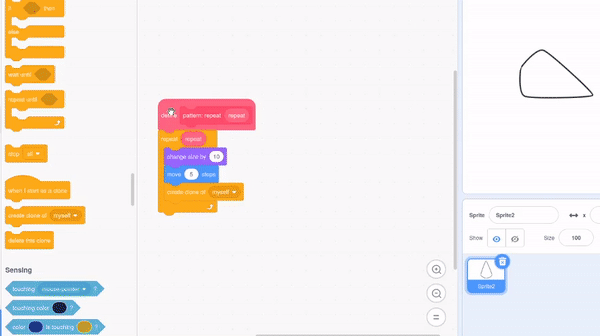
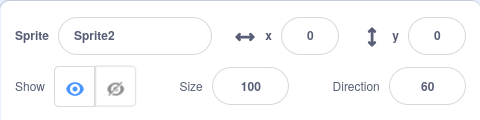

## ಮಂಡಲ ಮಾಡಿ

<div style="display: flex; flex-wrap: wrap">
<div style="flex-basis: 200px; flex-grow: 1; margin-right: 15px;">
ಮಂಡಲವನ್ನು ಮಾಡಲು ಇನ್ನಷ್ಟು ವಿನ್ಯಾಸಗಳನ್ನು ರಚಿಸಿ!
</div>
<div>
{:width="300px"}
</div>
</div>

--- task ---

ನಿಮ್ಮ `define pattern`{:class="block3myblocks"} ಬ್ಲಾಕ್‌ ಮೇಲೆ ರೈಟ್-ಕ್ಲಿಕ್‌ ಮಾಡಿ ಮತ್ತು ಹೆಚ್ಚು ಪ್ಯಾರಾಮೀಟರ್‌ಗಳನ್ನು ಸೇರಿಸಲು **Edit** ಆಯ್ಕೆ ಮಾಡಿ.



ನೀವು `size`{:class="block3myblocks"} ಪಠ್ಯ ಗುರುತಿನ ಚೀಟಿ ಮತ್ತು `size`{:class="block3myblocks"} ಇನ್‌ಪುಟ್‌ ಸೇರಿಸಿ ಪ್ರಾರಂಭಿಸಬಹುದು. ನಂತರ, `move`{:class="block3myblocks"} ಗುರುತಿನ ಚೀಟಿ ಮತ್ತು ಇನ್‌ಪುಟ್‌ ಸೇರಿಸಿ, ಮತ್ತು ಈ ಪ್ಯಾರಾಮೀಟರ್‌ಗಳನ್ನು ಕೆಳಗಿನ ಬ್ಲಾಕ್‌ಗಳಲ್ಲಿ ಉಪಯೋಗಿಸಿ.


```blocks3
define pattern: repeat (repeat) size (size) move (move)
repeat (repeat)
change size by (size)
move (move) steps
create clone of (myself v)

when flag clicked
pattern: repeat (3) size (10) move (5)
```

--- /task ---

--- task ---

**ಪರೀಕ್ಷೆ:** ನಿಮ್ಮ ಪ್ರೋಗ್ರಾಮ್‌ನ್ನು ರನ್‌ ಮಾಡಲು ಹಸಿರು ಬಾವುಟ ಕ್ಲಿಕ್‌ ಮಾಡಿ ನಿಮ್ಮ ವಿನ್ಯಾಸ ಹೇಗೆ ಕಾಣುತ್ತದೆ ಎಂದು ನೋಡಿ. ಅದು ಇನ್ನೂ ಮಂಡಲದಂತೆ ಕಾಣಿಸುವುದಿಲ್ಲ! ನೀವು ವಿನ್ಯಾಸವನ್ನು ಹೇಗೆ ವೃತ್ತಾಕಾರ ಮಾಡಬಹುದು ಎಂದು ನೀವು ಯೋಚಿಸಬಹುದೇ?

--- /task ---

ನಿಮ್ಮ ವಿನ್ಯಾಸವನ್ನು ವೃತ್ತಾಕಾರ ಮಾಡಲು ಮತ್ತು ಇನ್ನಷ್ಟು ಮಂಡಲದಂತೆ ಕಾಣಲು, ಇನ್ನೊಂದು ಇನ್‌ಪುಟ್‌ ಸೇರಿಸಿ.

--- task ---

`turn`{:class="block3myblocks"} ಎನ್ನುವ ಇನ್ನೊಂದು ಇನ್‌ಪುಟ್‌ನ್ನು ಸೇರಿಸಿ. ನಂತರ, ನೀವು ನಿಮ್ಮ ತದ್ರೂಪವನ್ನು ಚಲಿಸುವುದರ ಜೊತೆಗೆ ಅದನ್ನು ತಿರುಗಿಸಬಹುದು ಕೂಡ.


```blocks3
define pattern: repeat (repeat) size (size) move (move) turn (turn)
repeat (repeat)
change size by (size)
move (move) steps
create clone of (myself v)
+ change size by ([0] - (size))
+ move ([0] - (move)) steps
+ turn right (turn) degrees
+ move (move) steps
+ create clone of (myself v)
+ move ([0] - (move)) steps
+ turn right (turn) degrees
end
```

--- /task ---

ಮಂಡಲಗಳು ಯಾವಾಗಲೂ ಸಂಕೀರ್ಣವಾಗಿರುತ್ತವೆ — ಅವುಗಳು ಒಂದೇ ರೀತಿಯ ವಿನ್ಯಾಸಗಳನ್ನು ಅನುಸರಿಸುವ ಅನೇಕ ಬೇರೆ ಬೇರೆ ಸಾಲುಗಳನ್ನು ಹೊಂದಿರಬಹುದು. ಉಳಿದಿರುವ ಮಂಡಲದ ಸಾಲುಗಳನ್ನು ನಿರ್ಮಾಣ ಮಾಡಲು ನೀವು ಮೂಲ ವಿನ್ಯಾಸವನ್ನು ರಚಿಸಬಹುದು.

--- task ---

ನಿಮ್ಮ `pattern`{:class="block3myblocks"} ನಲ್ಲಿ ಬೇರೆ ಬೇರೆ ಸಂಖ್ಯೆಗಳ ಜೊತೆ ಆಟವಾಡಲು ಪ್ರಯತ್ನಿಸಿ. ನೀವು ಯಾವಾಗಬೇಕಾದರೂ ನಿಮ್ಮ ಸ್ಪ್ರೈಟ್‌ನ ಸ್ಥಾನ ಮತ್ತು ಗಾತ್ರವನ್ನು ಮರುಹೊಂದಿಸಬಹುದು.



```blocks3
when flag clicked
pattern repeat (3) size (0) move (0) turn (60) ::custom
```

--- /task ---


ನಿಮಗೆ ಈಗ ಮೂಲ ವಿನ್ಯಾಸವಿರುವುದರಿಂದ, ನೀವು ನಿಮ್ಮ `pattern`{:class="block3myblocks"} ನ್ನು ಹಲವಾರು ಬಾರಿ ಉಪಯೋಗಿಸಿ ಪುನರಾವರ್ತನೆಯಾಗುವ ವಿನ್ಯಾಸವನ್ನು, ಅಥವಾ ಮಂಡಲದ 'ಸಾಲುಗಳನ್ನು' ಮಾಡಬಹುದು. ನೀವು ಒಂದೇ ಕೋಡ್‌ನ್ನು ಪದೆ ಪದೆ ಉಪಯೋಗಿಸುವ ಮೂಲಕ, ನೀವು **optimised** ಆಗಿರುವ ಪ್ರೋಗ್ರಾಮ್‌ನ್ನು ಮಾಡುವಿರಿ.

<p style="border-left: solid; border-width:10px; border-color: #0faeb0; background-color: aliceblue; padding: 10px;">
<span style="color: #0faeb0">**ಉತ್ತಮಗೊಳಿಸುವಿಕೆ**</span> ಎಂದೆರೆ ಕೆಲಸಗಳನ್ನು ಅತ್ಯಂತ ಸಮರ್ಥ ರೀತಿಯಲ್ಲಿ ಮಾಡುವುದು. ಈ ಕೆಳಗಿನ ರೇಖಾಕೃತಿಯನ್ನು ನೋಡಿ. ನೀವು A ಯಿಂದ E ಗೆ A-->B-->C-->D-->E ಪಥವನ್ನು ಅನುಸರಿಸಿ ಹೋಗಬಹುದು. ಉತ್ತಮಗೊಳಿಸುವಿಕೆ ಎಂದರೆ A-->D-->E ಗೆ ಹೋಗುವುದು, ಅದು ಕಡಿಮೆ ಹಂತಗಳನ್ನು ಮತ್ತು ಕಡಿಮೆ ದೂರವನ್ನು ಒಳಗೊಂಡಿರುತ್ತದೆ.

</p>

--- task ---

ನಿಮ್ಮ `when flag clicked`{:class="block3events"} ಕೆಳಗೆ, ಇನ್ನೂ ಕೆಲವು **calls**ನ್ನು ನಿಮ್ಮ `pattern`{:class="block3myblocks"}ಗೆ ಸೇರಿಸಿ.


```blocks3
when flag clicked
pattern repeat (3) size (0) move (0) turn (60) ::custom
pattern repeat (6) size (10) move (45) turn (30) ::custom
pattern repeat (6) size (10) move (90) turn (30) ::custom
```

--- /task ---

--- task ---

**ಪರೀಕ್ಷೆ:** ಹಸಿರು ಬಾವುಟವನ್ನು ಕ್ಲಿಕ್‌ ಮಾಡಿ, ಮತ್ತು ಯಾವ ವಿನ್ಯಾಸವು ಉತ್ಪತ್ತಿಯಾಗಿದೆ ಎಂದು ನೋಡಿ. ನಿಮಗೆ ಇಷ್ಟವಾದ ವಿನ್ಯಾಸಗಳೊಡನೆ ಪ್ರಯೋಗಮಾಡಲು ನೀವು ಸಂಖ್ಯೆಗಳನ್ನು ಬದಲಾಯಿಸಬಹುದು ಅಥವಾ ನಿಮ್ಮ`pattern`{:class="block3myblocks"}ಗೆ ಇನ್ನಷ್ಟು ಕರೆಗಳನ್ನು ಸೇರಿಸಬಹುದು.

--- /task ---

--- save ---
