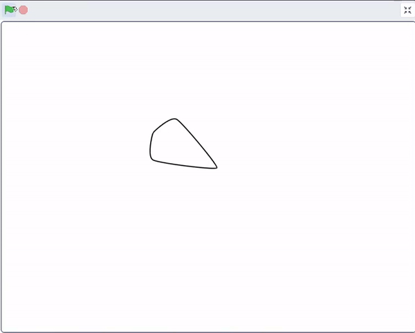

## ನಿಮ್ಮ ಸ್ಪ್ರೈಟ್‌ನ್ನು ಹೊಂದಿಸಿ

<div style="display: flex; flex-wrap: wrap">
<div style="flex-basis: 200px; flex-grow: 1; margin-right: 15px;">
ನಿಮ್ಮ ಮಂಡಲವನ್ನು ಮರುಹೊಂದಿಸಲು ನಿಮ್ಮ ಸ್ಪ್ರೈಟ್‌ನ್ನು ಹೊಂದಿಸಿ.
</div>
<div>
{:width="300px"}
</div>
</div>

ಈ ಸಮಯದಲ್ಲಿ, ನೀವು ಉಪಯೋಗಿಸುವ ಪ್ಯಾರಾಮೀಟರ್‌ ಮೌಲ್ಯಗಳನ್ನು ಆಧರಿಸಿ, ನಿಮ್ಮ ಮಂಡಲದ ವಿನ್ಯಾಸಗಳು ಪ್ರತಿಬಾರಿ ಬದಲಾಗುತ್ತಿರುವಂತೆ ಕಾಣಬಹುದು. ನಂತರ, ನೀವು ಹೊಸ `my blocks`{:class="block3myblocks"} ರಚಿಸುತ್ತೀರಿ, ಅದರಿಂದ ನಿಮ್ಮ **mandala** ಸ್ಪ್ರೈಟ್‌ ಯಾವಾಗಲೂ ಒಂದೇ ಸ್ಥಿತಿಯಲ್ಲಿ ಶುರುವಾಗುತ್ತದೆ.

--- task ---

`setup`{:class="block3myblocks"} ಎನ್ನುವ ಹೊಸ ಬ್ಲಾಕ್‌ನ್ನು ರಚಿಸಲು `My Blocks`{:class="block3myblocks"} ಮೆನುವನ್ನು ಉಪಯೋಗಿಸಿ. ಬ್ಲಾಕ್‌ ನಾಲ್ಕು ಪ್ಯಾರಾಮೀಟರ್‌ಗಳನ್ನು ಹೊಂದಿರಬೇಕು: `size`{:class="block3myblocks"}, `ghost`{:class="block3myblocks"}, `y`{:class="block3myblocks"}, ಮತ್ತು `move`{:class="block3myblocks"}. ಚಿಂತಿಸಬೇಡಿ, ನೀವು ಆಮೇಲೆ ಇವುಗಳನ್ನು ಬದಲಾಯಿಸಬಹುದು ಅಥವಾ ಇನ್ನಷ್ಟು ಸೇರಿಸಬಹುದು.


```blocks3
define setup: size (size) ghost (ghost) y (y) move (move)
```

--- /task ---

ಮುಂದಿನ ಹಂತದಲ್ಲಿ ನೀವು ಮಂಡಲವನ್ನುವರ್ಣಮಯವಾಗಿಸಿದಾಗ, `ghost`{:class="block3myblocks"} ಬ್ಲಾಕ್‌ ಬಣ್ಣಗಳನ್ನು ಪಾರದರ್ಶಕವಾಗಿಸುತ್ತದೆ ಅದರಿಂದ ಆಕಾರಗಳೂ ಒಂದರ ಮೇಲೆ ಒಂದು ವ್ಯಾಪಿಸಿದಾಗ, ನಿಮಗೆ ಬಣ್ಣಗಳ ಮಿಶ್ರಣದ ಪರಿಣಾಮ ಸಿಗುತ್ತದೆ.

--- task ---

ಈಗ ನಿಮ್ಮ ಸ್ಪ್ರೈಟ್‌ನ ನೋಟ ಮತ್ತು ಸ್ಥಾನವನ್ನುಹೊಂದಿಸಲು ಇನ್ನೂ ಕೆಲವು ಬ್ಲಾಕ್‌ಗಳನ್ನು ಸೇರಿಸಿ.


```blocks3
define setup: size (size) ghost (ghost) y (y) move (move)
+ set size to (size) %
+ set [ghost v] effect to (ghost)
+ go to x: (0) y: (0)
+ point in direction (90)
+ change y by (y)
+ move (move) steps
```

--- /task ---

--- task ---

ಈ ಸಮಯದಲ್ಲಿ, ನಿಮ್ಮ `my blocks`{:class="block3myblocks"} ಬಳಕೆಯಾಗಿಲ್ಲ, ಆದುದರಿಂದ ನಿಮ್ಮ ವಿನ್ಯಾಸದ ಮೇಲೆ ಯಾವುದೇ ಪರಿಣಾಮ ಆಗುವುದಿಲ್ಲ. `setup`{:class="block3myblocks"}ಗೆ ಕೋಡ್‌ ಸೇರಿಸಿ, ಅದರಿಂದ ಬಾವುಟವನ್ನು ಕ್ಲಿಕ್‌ ಮಾಡಿದ ತಕ್ಷಣ ಕೋಡ್‌ ರನ್‌ ಆಗುತ್ತದೆ.


```blocks3
when flag clicked
+ setup: size (60) ghost (50) y (10) move (10) ::custom
pattern: repeat (3) size (10) move (5) turn (60) ::custom
pattern: repeat (5) size (10) move (45) turn (30) ::custom
pattern: repeat (6) size (10) move (90) turn (30) ::custom
```

--- /task ---

--- task ---

ನಿಮ್ಮ ಕೋಡ್‌ನ್ನು ಪರೀಕ್ಷಿಸಲು ಬಾವುಟದ ಮೇಲೆ ಕ್ಲಿಕ್‌ ಮಾಡಿ ಮತ್ತು ಚಿತ್ರಿಸಿರುವ ವಿನ್ಯಾಸವನ್ನು ಅವಲೋಕನಮಾಡಿ **ಪರೀಕ್ಷೆ** ಮಾಡಿ. ನಂತರ, ನಿಮಗೆ ಇಷ್ಟವಾದ ವಿನ್ಯಾಸ ದೊರಕುವವರೆಗೆ ಪ್ಯಾರಾಮೀಟರ್‌ಗಳ ಮೌಲ್ಯವನ್ನು ಬದಲಾಯಿಸಿ.

--- /task ---

--- task ---

ಸ್ಪ್ರೈಟ್‌ (ಅದರ ತದ್ರೂಪಗಳಲ್ಲ) ಇನ್ನೂ ಕಾಣಿಸುತ್ತಿದೆ; ಅದನ್ನು ಕೊನೆಯಲ್ಲಿ ಮರೆಮಾಡಬಹುದು, ಅದರೆ ಪ್ರಾರಂಭದಲ್ಲಿ ತೋರಿಸಬೇಕು.


```blocks3
when flag clicked
+ show
setup: size (60) ghost (50) y (10) move (10) ::custom
pattern: repeat (3) size (10) move (5) turn (60) ::custom
pattern: repeat (5) size (10) move (45) turn (30) ::custom
pattern: repeat (6) size (10) move (90) turn (30) ::custom
+ hide
```

--- /task ---

--- save ---
