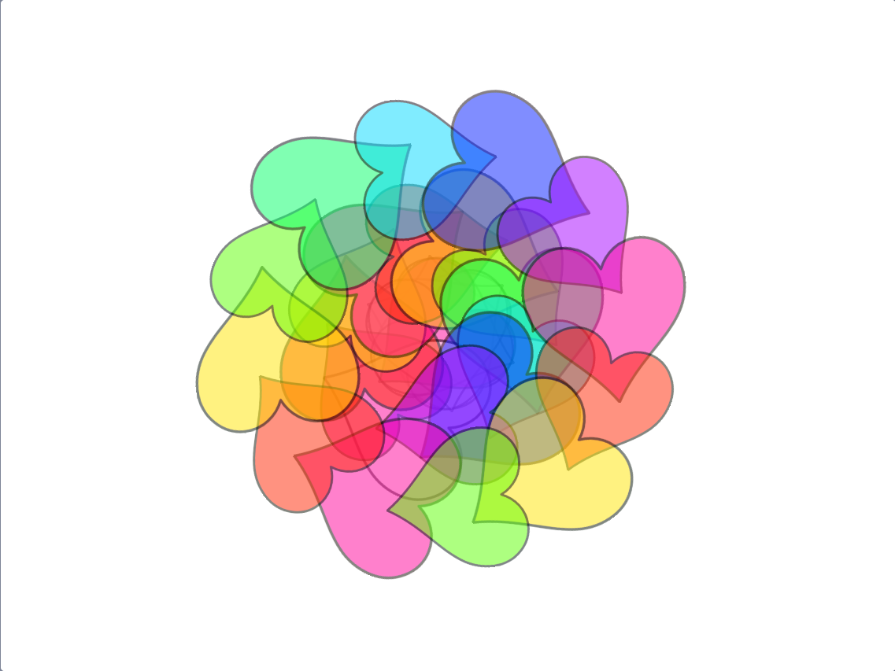

## ಮಂಡಲಕ್ಕೆ ಬಣ್ಣ ತುಂಬುವುದು

<div style="display: flex; flex-wrap: wrap">
<div style="flex-basis: 200px; flex-grow: 1; margin-right: 15px;">
ಮಂಡಲಕ್ಕೆ ಬಣ್ಣ ತುಂಬುವುದು ಚಿಕಿತ್ಸಕ ಜೊತೆಗೆ ರಚನಾತ್ಮಕ ಚಟುವಟಿಕೆ. ಮಂಡಲಗಳ ವಿವಿಧ ಭಾಗಗಳಿಗೆ ಬಣ್ಣ ತುಂಬಿಸಲು ಅವಕಾಶಗಳನ್ನು ಸೇರಿಸಿ.
</div>
<div>
{:width="300px"}
</div>
</div>

**ಸಲಹೆ:** ನಿಮಗೆ ಬೇಕಾದರೆ, ನೀವು ಈ ಹಂತದಲ್ಲಿ ಮಂಡಲಗಳಿಗೆ ಬಣ್ಣ ತುಂಬುವ ಮೊದಲು ಅವುಗಳನ್ನು ಮುದ್ರಿಸಿಕೊಳ್ಳಬಹುದು, ಮತ್ತು ಅವುಗಳನ್ನು ಕೈಯಿಂದ ಬಣ್ಣ ತುಂಬಲು ಬಣ್ಣ ತುಂಬುವ ವಿನ್ಯಾಸಗಳಾಗಿ ಉಪಯೋಗಿಸಬಹುದು.

--- task ---

**shape** ಸ್ಪ್ರೈಟ್‌ನ ಈಗಿನ ಉಡುಪುಗಳನ್ನು ಒಮ್ಮೆ ನೋಡಿ. ನೀವು ಅಲ್ಲಿ ಎರಡು ಉಡುಪುಗಳಿರುವುದನ್ನು ನೋಡುತ್ತೀರಿ, ಒಂದು ಬಿಳಿಯದು ಮತ್ತು ಇನ್ನೊಂದು ತುಂಬಿಸಿರುವುದು.


--- /task ---

ನಿಮ್ಮ ಮಂಡಲಕ್ಕೆ ಬಣ್ಣ ತುಂಬಿಸಲು, ತದ್ರೂಪವನ್ನು ಕ್ಲಿಕ್‌ ಮಾಡಿದಾಗ ಪ್ರತಿಯೊಂದು ತದ್ರೂಪದ ಆಕಾರವೂ ಅದರ `costume`{:class="block3looks"} ಮತ್ತು ನಂತರ ಅದರ `color effect`{:class="block3looks"} ನ್ನು ಬದಲಾಯಿಸಬೇಕು. ಹೊಸ ಉಡುಪು ಹಿಂದಿನ ಉಡುಪು ಏನಾಗಿತ್ತೋ ಅದಕ್ಕಿಂತ **ಒಂದು** ಹೆಚ್ಚಿರುತ್ತದೆ, ಅದರಿಂದ ಅದು ಬಣ್ಣದ ಆವೃತ್ತಿಗೆ ಬದಲಾಗುತ್ತದೆ ಮತ್ತು ನಂತರ ಬೇರೆ ಬೇರೆ ಬಣ್ಣಗಳಿಗೆ ಬದಲಾಗುತ್ತದೆ.

--- task ---

`when this sprite clicked`{:class="block3events"} ಬ್ಲಾಕ್‌ನ್ನು ಸೇರಿಸಿ, ಮತ್ತು ನಂತರ `+`{:class="block3operators"} ಆಪರೇಟರ್‌ನ್ನು ಉಡುಪಿನ ಸಂಖ್ಯೆ ಬದಲಾಯಿಸಲು ಉಪಯೋಗಿಸಿ.


```blocks3
when this sprite clicked
switch costume to ((answer) + (1))
```

--- /task ---

--- task ---

ಈ ಬರಹಕ್ಕೆ `change color effect`{:class="block3looks"} ಬ್ಲಾಕ್‌ನ್ನು ಸೇರಿಸಿ, ಅದರಿಂದ ಪ್ರತಿಯೊಂದು ಬಾರಿ ಸ್ಪ್ರೈಟ್‌ನ್ನು ಕ್ಲಿಕ್ ಮಾಡಿದಾಗ, ಬಣ್ಣವು ಸ್ವಲ್ಪ ಬದಲಾಗುತ್ತದೆ.


```blocks3
when this sprite clicked
switch costume to ((answer) + (1))
change [color v] effect by (25)
```

--- /task ---

ಕೊನೆಯ ಹಂತದಲ್ಲಿ ನಿಮ್ಮ ಪ್ರಾಜೆಕ್ಟ್‌ಗೆ `ghost`{:class="block3myblocks"} ಬ್ಲಾಕ್‌ ಇನ್‌ಪುಟ್‌ನ್ನು ಸೇರಿಸಿದ್ದು ನಿಮಗೆ ನೆನಪಿರಬಹುದು. ನೀವು `ghost`{:class="block3myblocks"} ನ್ನು ಆಹ್ವಾನಿಸಿದಲ್ಲಿ ಸಂಖ್ಯೆಯನ್ನು ಬದಲಿಸಿದಾಗ ಏನಾಗುತ್ತದೆ ಎಂದು ನೀವು ಈಗ ನೋಡಲು ಸಾಧ್ಯವಾಗಬೇಕು.

--- task ---

ನಿಮ್ಮ `ghost`{:class="block3myblocks"} ಸಂಖ್ಯೆಗಳನ್ನು ಬದಲಾಯಿಸಿ ನಿಮಗೆ ಬೇಕಾದ ಬಣ್ಣಗಳ ಪರಿಣಾಮವನ್ನು ರಚಿಸಿ. `ghost`{:class="block3myblocks"} ನ ಕಡಿಮೆ ಸಂಖ್ಯೆ ಎಂದರೆ ಬಣ್ಣವು ಪರ್ಮನೆಂಟ್‌ ಮಾರ್ಕರ್‌ನಂತೆ ಹೆಚ್ಚು ತುಷ್ಟಿಯಾಗಿರುತ್ತದೆ. `ghost`{:class="block3myblocks"} ನ ಹೆಚ್ಚಿನ ಸಂಖ್ಯೆ ಎಂದರೆ ಬಣ್ಣವು ವಾಟರ್‌ಕಲರ್‌ನಂತೆ ಕಡಿಮೆ ತುಷ್ಟಿಯಾಗಿರುತ್ತದೆ.

--- /task ---

--- task ---

**ಪರೀಕ್ಷೆ:** ಬಾವುಟವನ್ನು ಕ್ಲಿಕ್‌ ಮಾಡಿ, ನಿಮ್ಮ ಉಡುಪನ್ನು ಆಯ್ಕೆ ಮಾಡಿ, ಮತ್ತು ನಂತರ ತದ್ರೂಪಗಳ ಮೇಲೆ ಕ್ಲಿಕ್‌ ಮಾಡಿ ಅವುಗಳ ಬಣ್ಣಗಳನ್ನು ಬದಲಾಯಿಸಲು ಪ್ರಯತ್ನಿಸಿ.



ಬಣ್ಣಗಳು ಪರಸ್ಪರ ಒಂದರ ಮೇಲೊಂದು ಪದರಗಳಾದಾಗ ನಿಮಗೆ ಕೆಲಿಡೋಸ್ಕೋಪ್‌ ಪರಿಣಾಮ ದೊರೆಯಬೇಕು.

--- /task ---

ನಿಮಗೆ ನೀವು ರಚಿಸಿದ ಮಂಡಲ ಇಷ್ಟವಾದರೆ ಆಗ ನೀವು ಸ್ಟೇಜ್‌ ಮೇಲೆ **right-click** ಮಾಡಿ ಚಿತ್ರವನ್ನು ಸೇವ್‌ ಮಾಡಲು ಆಯ್ಕೆಮಾಡಿಕೊಳ್ಳಬಹುದು.


--- save ---
