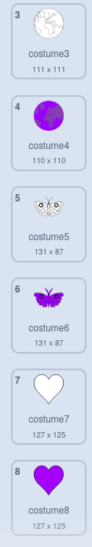

## ಇನ್ನೊಂದು ಮಂಡಲವನ್ನು ರಚಿಸಿ

<div style="display: flex; flex-wrap: wrap">
<div style="flex-basis: 200px; flex-grow: 1; margin-right: 15px;">
ಉತ್ತಮಗೊಳಿಸಿದ ನಿಮ್ಮ ಬ್ಲಾಕ್‌ಗಳನ್ನು ಉಪಯೋಗಿಸಿ ಇನ್ನೊಂದು ಮಂಡಲವನ್ನು ಸುಲಭವಾಗಿ ರಚಿಸಿ.
</div>
<div>

</div>
</div>

ನಿಮ್ಮ ಬಣ್ಣ ತುಂಬಿದ ಮಂಡಲವನ್ನು ರಚಿಸಲು ನೀವು ಉಪಯೋಗಿಸುವ ಎರಡು ಉಡುಪುಗಳು ಇವೆ. ನಿಮ್ಮ ಮಂಡಲವನ್ನು ಇನ್ನಷ್ಟು ವಯಕ್ತಿಕಗೊಳಿಸಲು ಇನ್ನಷ್ಟು ಉಡುಪುಗಳನ್ನು ಸೇರಿಸಿ.

--- task ---

**ಆಯ್ಕೆ ಮಾಡಿಕೊಳ್ಳಿ:** ಇನ್ನೊಂದು ಉಡುಪನ್ನು ಸೇರಿಸಿ. ಇಲ್ಲಿ **Earth** ಉಡುಪನ್ನು ಆಯ್ಕೆ ಮಾಡಿಕೊಳ್ಳಲಾಗಿದೆ.


ನೀವು ಯಾವ ಉಡುಪನ್ನು ಆಯ್ಕೆ ಮಾಡಿಕೊಂಡರೂ ಪರವಾಗಿಲ್ಲ, ಆದರೆ ನೀವು ಅದು **Vector** ಉಡುಪು ಮತ್ತು **Bitmap** ಉಡುಪಲ್ಲ ಎಂದು ಖಚಿತಪಡಿಸಿಕೊಳ್ಳಬೇಕು. ನೀವು **Convert to Bitmap** ಎಂದು ಹೆಸರಿರುವ ಬಟನ್‌ನ್ನು ನೋಡಿದಾಕ್ಷಣ ನೀವು **Vector** ಉಡುಪು ಆಯ್ಕೆ ಮಾಡಿಕೊಂಡಿದ್ದೇನೆ ಎಂದು ಹೇಳಬಹುದು. **ಈ ಬಟನ್‌ನ್ನು ಕ್ಲಿಕ್‌ ಮಾಡಬೇಡಿ**. ನೀವು **Bitmap** ಆಗಿರುವ ಉಡುಪನ್ನು ಆಯ್ಕೆ ಮಾಡಿಕೊಂಡಿದ್ದರೆ, ಆಗ ಅದನ್ನು ಅಳಿಸಿ ಮತ್ತೊಂದನ್ನು ಆಯ್ಕೆ ಮಾಡಿಕೊಳ್ಳಿ.


--- /task ---

--- task ---

ನಿಮಗೆ ಬಾಹ್ಯರೇಖೆ ಮಾತ್ರ ದೊರೆಯುವಂತೆ ಉಡುಪಿನಿಂದ ಎಲ್ಲಾ ಬಣ್ಣಗಳನ್ನು ತೆಗೆಯಿರಿ. ಸಂಪೂರ್ಣ ಉಡುಪನ್ನು ಆಯ್ಕೆ ಮಾಡಿ ಮತ್ತು **Fill** **Saturation** ನ್ನು `0` ಗೆ ಬದಲಾಯಿಸಿ ಮತ್ತು **Outline** **Brightness** ನ್ನು `0` ಗೆ ಬದಲಾಯಿಸಿ.


--- /task ---

--- task ---

ಈ ಉಡುಪನ್ನು ನಕಲು ಮಾಡಿ, ಮತ್ತು ನಂತರ ಪ್ರಕ್ರಿಯೆಯನ್ನು ಪುನರಾವರ್ತಿಸಿ, ಈ ಬಾರಿ **Fill** ಬಣ್ಣವನ್ನು ನಿಮ್ಮ ಆಯ್ಕೆಯ ಗಾಢ ಬಣ್ಣಕ್ಕೆ ಬದಲಾಯಿಸಿ.


--- /task ---

--- task ---

ನಿಮಗೆ ವಿಭಿನ್ನ ಶೈಲಿಗಳ ಉಡುಪು ಕೊಡಲು, ಬೇರೆ ಬೇರೆ ವೆಕ್ಟರ್‌ ಉಡುಪುಗಳ ಜೊತೆ ಈ ಪ್ರಕ್ರಿಯೆಯನ್ನು ಇನ್ನೂ ಹಲವು ಬಾರಿ ಪುನರಾವರ್ತಿಸಿ.



--- /task ---

ನಿಮ್ಮ ವಯಕ್ತಿಕಗೊಳಿಸಿದ ಮಂಡಲಗಳಿಗೆ ನೀವು ಬಣ್ಣ ತುಂಬಬಹುದು ಎಂಬುವುದನ್ನು ಖಚಿತಪಡಿಸಿಕೊಳ್ಳಲು, ನಿಮ್ಮ ಉಡುಪುಗಳನ್ನು ಮರುಕ್ರಮಗೊಳಿಸಿ ಮತ್ತು ಉಡುಪು ಸರಿಯಾದ ಸಂಖ್ಯೆಗೆ ಬದಲಾಗುತ್ತದೆಯೇ ಎಂದು ಪರಿಶೀಲಿಸಿ.

--- task ---

ನಿಮ್ಮ ಉಡುಪುಗಳನ್ನು ಮರುಕ್ರಮಗೊಳಿಸಿ, ಅದರಿಂದ ಬಿಳಿಬಣ್ಣದಿಂದ ತುಂಬಿರುವವುಗಳು ಮೇಲಿರುತ್ತವೆ, ಮತ್ತು ಬಣ್ಣದಿಂದ ತುಂಬಿರುವವುಗಳು ಕೆಳಗಡೆ ಇರುತ್ತವೆ, ಆದರೆ ಅದೇ ಕ್ರಮದಲ್ಲಿರುತ್ತವೆ.


--- /task ---

ನಿಮ್ಮ ಹೊಸ ಮಂಡಲಗಳಿಗೆ ನೀವು ಬಣ್ಣ ತುಂಬಿಸಲು ಸಾಧ್ಯವಾಗುವಂತೆ ಮಾಡಲು ಯಾವ ಉಡುಪಿಗೆ ಪರಿವರ್ತನೆಯಾಗುತ್ತದೆ ಎಂಬುವುದನ್ನು ಬದಲಾಯಿಸಲು ಮರೆಯಬೇಡಿ. ಉದಾಹರಣೆಯ ಪ್ರಾಜೆಕ್ಟ್‌ನಲ್ಲಿ, ನಾಲ್ಕು ಮಂಡಲಗಳಿವೆ ಆದುದರಿಂದ ನಾವು ಉಡುಪು ಸಂಖ್ಯೆಯನ್ನು'1' ರಿಂದ '4 ಕ್ಕೆ' ಬದಲಾಯಿಸಿದೆವು


```blocks3
when this sprite clicked
+ switch costume to ((answer) + (4))
change [color v] effect by (25)
```

--- task ---

**ಪರೀಕ್ಷೆ:** ನಿಮ್ಮ ಯಾವುದಾದರೊಂದು ಹೊಸ ಉಡುಪಿಗೆ ಬದಲಾಗಿ ಮತ್ತು ಉತ್ಪತ್ತಿಯಾಗುವ ವಿನ್ಯಾಸವನ್ನು ನೋಡಲು ಹಸಿರು ಬಾವುಟವನ್ನು ಕ್ಲಿಕ್‌ ಮಾಡಿ.

--- /task ---

--- save ---
