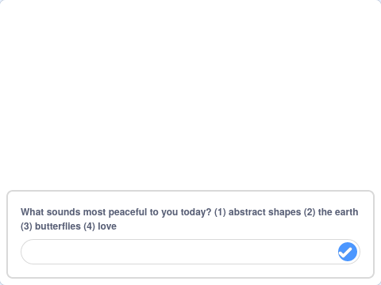

## ನಿಮ್ಮ ಮಂಡಲವನ್ನು ಆಯ್ಕೆ ಮಾಡಿಕೊಳ್ಳಿ

<div style="display: flex; flex-wrap: wrap">
<div style="flex-basis: 200px; flex-grow: 1; margin-right: 15px;">
ಪ್ರತಿಯೊಬ್ಬರೂ ವಿಭಿನ್ನ. ನಿಮ್ಮ ಮಂಡಲ ಪ್ರೋಗ್ರಾಮ್‌ ಉಪಯೋಗಿಸುವ ವ್ಯಕ್ತಿಗೆ ಅವರಿಗೆ ಯಾವುದು ಅತ್ಯಂತ ಪ್ರಶಾಂತವೆನಿಸುತ್ತದೆಯೋ ಅದನ್ನು ಆಧರಿಸಿ ಆಯ್ಕೆಯನ್ನು ಕೊಡಿ.
</div>
<div>
{:width="300px"}
</div>
</div>

ನೀವು ಈಗ ಕನಿಷ್ಠ ಎರಡು ಬೇರೆ ಬೇರೆ ಮಂಡಲಗಳನ್ನು ಹೊಂದಿರಬೇಕು. ನಿಮ್ಮ ಮಂಡಲ ಪ್ರೋಗ್ರಾಮ್‌ನ್ನು ಯಾರು ಉಪಯೋಗಿಸುತ್ತಾರೋ ಅವರಿಗೆ ಆಯ್ಕೆ ಕೊಡಲು, ನೀವು ಪ್ರಾರಂಭದ ಮೆನು ರಚಿಸಲು `ask`{:class="block3sensing"} ಬ್ಲಾಕ್‌ ಉಪಯೋಗಿಸಬಹುದು.

<p style="border-left: solid; border-width:10px; border-color: #0faeb0; background-color: aliceblue; padding: 10px;">
<span style="color: #0faeb0">**ಸ್ಟಾರ್ಟ್‌ ಮೆನೂಗಳು**</span> ಯಾವಾಗಲೂ ಆಟಗಳಲ್ಲಿ ಮತ್ತು ಆಪ್‌ಗಳಲ್ಲಿ ಕಂಡುಬರುತ್ತವೆ. ಅವುಗಳು ಆಟವಾಡುತ್ತಿರುವ ಅಥವಾ ಆಪ್‌ ಉಪಯೋಗಿಸುತ್ತಿರುವ ವ್ಯಕ್ತಿಗೆ ಬಹಳಷ್ಟು ಆಯ್ಕೆಗಳಿಂದ ಆಯ್ದುಕೊಳ್ಳಲು ಅನುವುಮಾಡಿಕೊಡುತ್ತವೆ, ಉದಾಹರಣೆಗೆ, ಅವರು ಯಾವ ಪಾತ್ರವನ್ನು ಆಡಲು ಬಯಸುತ್ತಾರೋ ಅಥವಾ ಯಾವ ಸೆಟ್ಟಿಂಗ್‌ಗಳನ್ನು ಬಯಸುತ್ತಾರೋ ಅವುಗಳು.
</p>

ನಿಮ್ಮ ಪ್ರಾರಂಭದ ಮೆನುನಲ್ಲಿ ನೀವು ಕೇಳುವ ಪ್ರಶ್ನೆಯನ್ನು ರಚಿಸಿ.

--- task ---

`ask and wait`{:class="block3sensing"} ಬ್ಲಾಕ್‌ನ್ನು `when flag clicked`{:class="block3events"} ಕೆಳಗೆ ಸೇರಿಸಿ ಮತ್ತು ಈ ಕೆಳಗಿನ ಉದಾಹರಣೆಯಂತೆ, ನಿಮ್ಮ ಪ್ರಶ್ನೆಗೆ ಪಠ್ಯವನ್ನು ಆಯ್ಕೆ ಮಾಡಿ.


```blocks3
when flag clicked
+ hide
+ ask [What feels most peaceful to you today? (1) abstract shapes (2) the earth (3) butterflies (4) love] and wait
show
setup: size (60) ghost (50) y (10) move (10) ::custom
pattern: repeat (3) size (10) move (5) turn (60) ::custom
pattern: repeat (5) size (10) move (45) turn (30) ::custom
pattern: repeat (6) size (10) move (90) turn (30) ::custom
hide
```

--- /task ---

`ask and wait`{:class="block3sensing"} ನ್ನು ಉಪಯೋಗಿಸುವ ಮೊದಲು ಸ್ಪ್ರೈಟ್‌ನ್ನು ಮರೆಮಾಚಲು ಕಾರಣವೇನೆಂದರೆ ಅದರಿಂದ ಪ್ರಶ್ನೆಯು ಸ್ಪ್ರೈಟ್‌ನಿಂದ ಮಾತಿನ ಗುಳ್ಳೆಯಂತಲ್ಲದೆ, ವೇದಿಕೆಯ ಕೆಳಗೆ ಕಾಣಿಸಿಕೊಳ್ಳುತ್ತದೆ.



ಸರಿಯಾದ ಮಂಡಲವನ್ನು ತೋರಿಸಲು ಉತ್ತರವನ್ನು ಸರಿಯಾದ ಸ್ಪ್ರೈಟ್‌ ಜೊತೆಗೆ ಹೊಂದಿಸಿ.

--- task ---

`switch costume to`{:class="block3looks"} `answer`{:class="block3sensing"} ಬ್ಲಾಕ್‌ನ್ನು `ask and wait`{:class="block3sensing"} ಬ್ಲಾಕ್‌ ಕೆಳಗೆ ಸೇರಿಸಿ.


```blocks3
when flag clicked
hide
ask [What feels most peaceful to you today? (1) abstract shapes (2) the earth (3) butterflies (4) love] and wait
+ switch costume to (answer)
show
setup: (60) (50) (10) (10) ::custom
pattern: (3) (10) (5) (60) ::custom
pattern: (5) (10) (45) (30) ::custom
pattern: (6) (10) (90) (30) ::custom
hide
```

--- /task ---

--- task ---

**ಪರೀಕ್ಷೆ**: ಬಾವುಟವನ್ನು ಕ್ಲಿಕ ಮಾಡಿ ಮತ್ತು ಸಂಖ್ಯೆಯನ್ನು ಆಯ್ಕೆ ಮಾಡಿಕೊಂಡು ನಿಮ್ಮ ಮಂಡಲ ಪ್ರಾಜೆಕ್ಟ್‌ನ್ನು ಪ್ರಯತ್ನಿಸಿ.

--- /task ---

--- save ---
