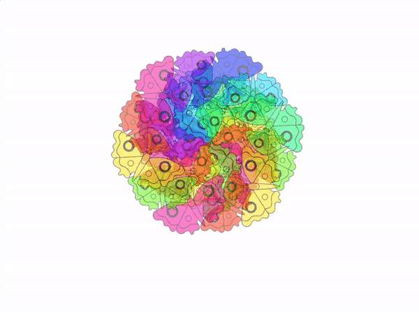

## ನಿಮ್ಮ ಪ್ರಾಜೆಕ್ಟ್‌ ಅಪ್‌ಗ್ರೇಡ್‌ ಮಾಡಿ

ನಿಮ್ಮ ಮಂಡಲಗಳನ್ನು ಕೆಲಿಡೋಸ್ಕೋಪ್‌ನ ರೀತಿ ಚಲಿಸುವಂತೆ ಮಾಡಿ.

ಸ್ವಲ್ಪ ಅಧಿಕ ವಿಶ್ರಾಂತಿಗೆ ನಿಮ್ಮ ತದ್ರೂಪಗಳು ಕೀಯನ್ನು ಒತ್ತಿದಾಗ ಅಥವಾ ಸ್ಪ್ರೈಟ್‌ನ್ನು ಕ್ಲಿಕ್‌ ಮಾಡಿದಾಗ ಸುತ್ತಲೂ ಚಲಿಸುವಂತೆ ಮಾಡಲು ನೀವು ಕೆಲವು ಬ್ಲಾಕ್‌ಗಳನ್ನು ಸೇರಿಸಬಹುದು. ಬಹುಶಹ ಯಾವುದಾದರೂ ಸೌಮ್ಯವಾದ ಸಂಗೀತವನ್ನು ಸಹ ನುಡಿಸಬಹುದು.

--- collapse ---
---
title: ಪೂರ್ಣಗೊಂಡ ಪ್ರಾಜೆಕ್ಟ್
---

ನೀವು [ಇಲ್ಲಿ ಪೂರ್ಣಗೊಂಡ ಪ್ರಾಜೆಕ್ಟ್ ನೋಡಬಹುದು](https://scratch.mit.edu/projects/536953224/){:target="_blank"}.

--- /collapse ---

--- save ---
