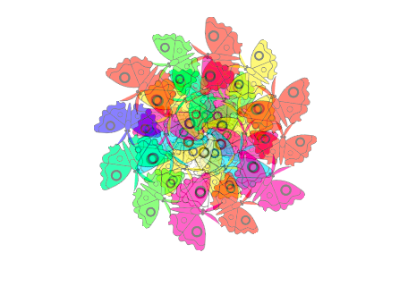
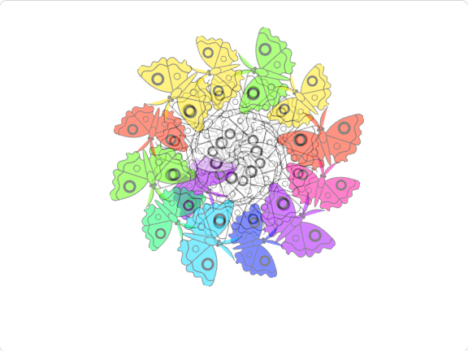

## परिचय

या प्रोजेक्टमध्ये, तुम्ही मंडल निर्माण करणारा प्रोग्राम तयार कराल.

**कंप्युटर निर्मीत आर्ट** किंवा **डिजीटल आर्ट** या कंप्युटरचा वापर करून तयार केलेल्या सोप्या कला आहेत. हे टॅबलेटवर तयार केलेल्या ड्रॉइंगपासून, कंप्युटरला स्वतःचे आर्ट तयार करण्यास सक्षम करण्यासाठी आर्टिफिशियल इंटेलिजेंस (AI) प्रोग्राम लिहिण्यापर्यंत असू शकते. या प्रोजेक्टमध्ये, तुम्ही अर्थपूर्ण आर्टवर्क तयार करण्यासाठी Scratch मधील प्रोग्रामींगचा वापर करणार आहात.

**मंडल** हा संस्कृत शब्द आहे ज्याला अर्थ "वर्तुळ" असा होतो. मंडलाला सामान्यपणे वर्तुळाकृती डिझाईन असते ज्याला पुनरावृत्ती रंग, आकार, आणि पॅटर्न असतात. बौद्ध आणि हिंदु धर्मात, मंडल ध्यानधारणेसाठी उपयोगी असतात. मंडल तयार करणे हे रीलॅक्स होण्याच्या आणि अर्थपूर्ण कृतींसाठी ओळखले जाते.

तुम्ही हे कराल:
+ पुनरावृत्ती पॅटर्न तयार करण्यासाठी क्लोन्सचा वापर करा
+ तुमचा कंप्युटर निर्मीत आर्ट प्रोग्राम तयार करण्यासाठी `My Blocks`{:class='block3myblocks'} चा वापर करा
+ स्प्राईटचे स्वरूप आणि पोजिशन बदलण्यासाठी addition `+`{:class='block3operators'} आणि subtraction `-`{:class='block3operators'} ऑपरेटर ब्लॉक्सचा वापर करा

--- no-print ---

### याचा प्रयत्न करा

--- task ---

  
आकार बदला आणि कंप्युटर निर्मीत मंडल बघा. तुम्ही मंडलाच्या आकारांमध्ये त्यावर क्लिक करून रंग भरू शकता (वेगवेगळ्या रंगांसाठी अनेक वेळा क्लिक करा), आणि त्यानंतर <kbd>स्पेसबार</kbd> दाबा.

तुम्ही पॅटर्न बघू शकलात का? Scratch ने तो पॅटर्न कसा तयार केला असे तुम्हाला वाटते?

आता वेगवेगळे आकार बदला आणि नवीन मंडल बघा. ते एकसारखे दिसतात का? ते सारख्या पॅटर्नचे अनुसरण करतात का?

<iframe src="https://scratch.mit.edu/projects/536953224/embed" allowtransparency="true" width="485" height="402" frameborder="0" scrolling="no" allowfullscreen></iframe>

--- /task ---

--- /no-print ---

--- print-only ---

--- /print-only ---
