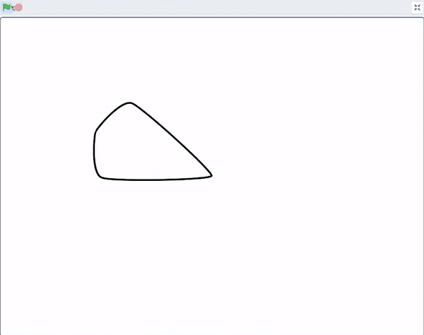

## पॅटर्न तयार करण्यासाठी आकार क्लोन करा

<div style="display: flex; flex-wrap: wrap">
<div style="flex-basis: 200px; flex-grow: 1; margin-right: 15px;">
पॅटर्न तयार करण्यासाठी आकार क्लोन करा.
</div>
<div>
{:width="300px"}
</div>
</div>

--- task ---

[Scratch स्टार्टर प्रोजेक्ट](https://scratch.mit.edu/projects/540476254/){:target="_blank"} उघडा. Scratch दुसऱ्या ब्राऊजर टॅबमध्ये उघडेल.

तुम्ही ऑफलाईन काम करत असल्यास, तुम्ही [स्टार्टर प्रोजेक्ट](https://scratch.mit.edu/projects/540476254/){:target="_blank"} डाऊनलोड करू शकता.

--- /task ---

तुम्हाला फुलांच्या पाकळीसारखा दिसणारा आकार स्प्राईट दिसायला हवा.

या आकारासह पॅटर्न तयार करण्यासाठी तुम्ही `my blocks`{:class="block3myblocks"} वापराल. तुम्हाला `my blocks`{:class="block3myblocks"} तयार करणे आठवू शकते तुमचा कोड [Nature Rover](https://projects.raspberrypi.org/mr-IN/projects/nature-rover/3){:target="_blank"} मध्ये व्यवस्थापित करण्यासाठी, आणि तोच कोड [Puzzle Room](https://projects.raspberrypi.org/mr-IN/projects/puzzle-room/4){:target="_blank"} मध्ये रीपीट करण्यासाठी. `My blocks`{:class="block3myblocks"} वेगवेगळ्या मार्गाने कृतींचा पुनर्वापर करण्यासाठी याचा वापर केला जाऊ शकतो.

--- task ---

`My Blocks`{:class='block3myblocks'} वर जा आणि तुमच्या ब्लॉक्सला नाव द्या (आम्ही त्याला `pattern:`{:class="block3myblocks"} म्हटले आहे). पहिले इनपुट ओळखण्यासाठी लेबल म्हणून किंवा प्रोग्रामर **पॅरामीटर** कशाला म्हणतो ते ओळखण्यासाठी `repeat`{:class="block3myblocks"} जोडा. प्रत्यक्षात तयार केलेल्या **पॅरामीटर** (parameter) ज्याला म्हणतात `repeat`{:class="block3myblocks"} त्यासाठी "Add an Input" वर क्लिक करा.


```blocks3
define pattern: repeat (repeat)
```

--- /task ---

पॅटर्न कसा तयार केला हे डिझाइन करण्यासाठी, पहिला टप्पा आहे `define pattern`{:class='block3myblocks'}.

--- task ---

`repeat`{:class='block3myblocks'} पॅरामीटर `define pattern`{:class='block3myblocks'} मधून `repeat`{:class='block3control'} लूप ब्लॉक मध्ये ड्रॅग करा.


```blocks3
define pattern: repeat (repeat)
repeat (repeat)
```

--- /task ---

अनेक वेळा तोच ब्लॉक दिसण्यासाठी तुम्ही आता `clone`{:class='block3control'} ब्लॉक्स वापराल. स्प्राइटचा आकार आणि स्थान बदलण्यासाठी तुम्ही कोड देखील जोडल्याची खात्री करा, अन्यथा स्प्राइट एकमेकांच्या वर स्टॅक केले जातील आणि तुम्ही ते पाहू शकणार नाही.

--- task ---

काही कोड `repeat`{:class='block3myblocks'} लूप मध्ये बघा जो तुमच्या `pattern`{:class='block3myblocks'} मध्ये आहे.


```blocks3
define pattern: repeat (repeat)
repeat (repeat)
+ change size by (10) //त्यामुळे तुम्ही क्लोन पाहू शकता
+ move (5) steps //त्यामुळे तुम्ही क्लोन पाहू शकता
+ create clone of (myself v)
```

--- /task ---

**टीप:** `Defining`{:class='block3myblocks'} सामान्य पॅटर्न आऊटलाईन तयार करतो. तुम्ही आत्ता `my blocks`{:class="block3myblocks"} सोबत जे करत आहात ते स्पिरोग्राफ स्टेन्सिल प्रमाणेच आहे; हा टूल आहे त्याचा वापर करून नंतर पॅटर्न तयार केला जातो.


--- task ---

तुमच्या `my blocks`{:class="block3myblocks"} सह पॅटर्न तयार करा. `pattern`{:class='block3myblocks'} हा अनेक वेळा `repeat`{:class='block3myblocks'} करण्यासाठी `when flag clicked`{:class='block3events'} वर आणा.


```blocks3
when flag clicked
show //आकार दाखवला जातो 
set size to (50) % //फार मोठे नाही
go to x: (0) y: (0) //मध्यभागी दाखवला गेला
pattern: repeat (3) ::custom
```

**चाचणी:** तुमचा प्रोग्राम रन करण्यासाठी हिरव्या झेंड्यावर क्लिक करून तुमचा पॅटर्न कसा दिसतो ते बघा.

--- /task ---

तुम्ही मंडल पॅटर्नची सुरूवात बघायला हवी. तुमच्या पॅटर्न मध्ये अधिक **पॅरामीटर्स**, किंवा आवश्यकता जोडल्याने तुमच्या मंडलाचा पहिला भाग तयार होईल.

--- save ---
