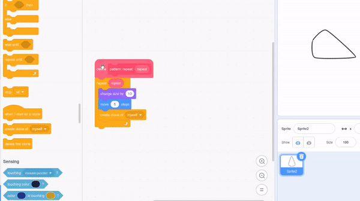

## मंडल तयार करा

<div style="display: flex; flex-wrap: wrap">
<div style="flex-basis: 200px; flex-grow: 1; margin-right: 15px;">
मंडल तयार करण्यासाठी अधिक पॅटर्न तयार करा!
</div>
<div>
{:width="300px"}
</div>
</div>

--- task ---

तुमच्या `define pattern`{:class="block3myblocks"} ब्लॉकवर राईट क्लिक करा आणि अधिक पॅरामीटर्स जोडण्यासाठी **Edit** निवडा.



तुम्ही `size`{:class="block3myblocks"} टेक्स्ट लेबल `size`{:class="block3myblocks"} इनपुट जोडून तुम्ही सुरूवात करू शकता. त्यानंतर,   `move`{:class="block3myblocks"} लेबल आणि इनपुट जोडा, आणि खालील ब्लॉक्स मध्ये या पॅरामीटर्सचा वापर करा.


```blocks3
define pattern: repeat (repeat) size (size) move (move)
repeat (repeat)
change size by (size)
move (move) steps
create clone of (myself v)

when flag clicked
pattern: repeat (3) size (10) move (5)
```

--- /task ---

--- task ---

**चाचणी:** तुमचा प्रोग्राम रन करण्यासाठी हिरव्या झेंड्यावर क्लिक करून तुमचा पॅटर्न कसा दिसतो ते बघा. ते अजून मंडलासारखे दिसत नाही! तुम्ही पॅटर्न गोलाकार कसे बनवू शकता याचा विचार करू शकता का?

--- /task ---

तुमचा पॅटर्न गोलाकार बनवण्यासाठी आणि आणखी मंडलासारखा दिसण्यासाठी, दुसरा इनपुट जोडा.

--- task ---

दुसरा इनपुट जोडा ज्याला म्हणतात `turn`{:class="block3myblocks"}. नंतर, तुमचा क्लोन हलवण्याबरोबरच, तुम्ही ते देखील वळवू शकता.


```blocks3
define pattern: repeat (repeat) size (size) move (move) turn (turn)
repeat (repeat)
change size by (size)
move (move) steps
create clone of (myself v)
+ change size by ([0] - (size))
+ move ([0] - (move)) steps
+ turn right (turn) degrees
+ move (move) steps
+ create clone of (myself v)
+ move ([0] - (move)) steps
+ turn right (turn) degrees
end
```

--- /task ---

मंडल बहुधा गुंतागुंतीची असतात — त्यांच्यात अनेक वेगवेगळ्या ओळी असू शकतात ज्या समान पॅटर्नचेअनुसरण करतात. उर्वरीत मंडलाच्या ओळी तयार करण्यासाठी तुम्ही बेस पॅटर्न तयार करू शकता.

--- task ---

तुमच्या `pattern`{:class="block3myblocks"} मध्ये वेगवेगळ्या संख्यांसह खेळण्याचा प्रयत्न करा. तुम्‍ही तुमच्‍या स्‍प्राईटची पोजिशन आणि आकार तुम्‍हाला आवडेल तेव्‍हा रीसेट करू शकता.


```blocks3
when flag clicked
pattern repeat (3) size (0) move (0) turn (60) ::custom
```

--- /task ---


आता तुमच्याकडे बेसिक पॅटर्न असल्यामुळे, तुम्ही पुनरावृत्ती पॅटर्न, किंवा मंडल "ओळी" तयार करण्यासाठी अनेक वेळा तुमचा `pattern`{:class="block3myblocks"} वापरू शकता. पुन्हा पुन्हा सारखाच कोड वापरून, तुम्ही प्रोग्राम तयार केला जो **ऑप्टीमाइज** केला आहे.

<p style="border-left: solid; border-width:10px; border-color: #0faeb0; background-color: aliceblue; padding: 10px;">
<span style="color: #0faeb0">**ऑप्टिमायझेशन**</span> म्हणजे सर्वात कार्यक्षम मार्गाने गोष्टी करणे. खालील आकृती बघा. तुम्ही A-->B-->C-->D-->E मार्गाचे अनुसरण करून A ते E मिळवू शकता. A-->D-->E जाण्यासाठी ऑप्टिमायझेशन असेल, ज्यामध्ये कमी टप्पे आणि कमी अंतर आहे.

</p>

--- task ---

तुमच्या `when flag clicked`{:class="block3events"} ब्लॉकच्या खाली, काही अधिक **calls** तुमच्या `pattern`{:class="block3myblocks"} मध्ये जोडा.


```blocks3
when flag clicked
pattern repeat (3) size (0) move (0) turn (60) ::custom
pattern repeat (6) size (10) move (45) turn (30) ::custom
pattern repeat (6) size (10) move (90) turn (30) ::custom
```

--- /task ---

--- task ---

**चाचणी:** हिरव्या झेंड्यावर क्लिक करा, आणि कोणता पॅटर्न तयार होतो ते बघा. तुम्हाला आवडणाऱ्या पॅटर्नचा प्रयोग करण्यासाठी तुम्ही संख्या बदलू शकता, किंवा तुमच्या `pattern`{:class="block3myblocks"} मध्ये अधिक कॉल जोडू शकता.

--- /task ---

--- save ---
