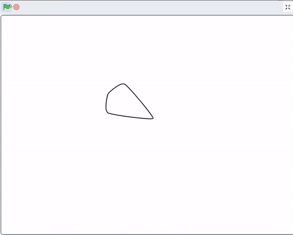
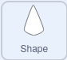

## तुमचा स्प्राइट सेट करा

<div style="display: flex; flex-wrap: wrap">
<div style="flex-basis: 200px; flex-grow: 1; margin-right: 15px;">
तुमचे मंडल रीसेट करण्यासाठी तुमचा स्प्राइट सेट करा.
</div>
<div>
{:width="300px"}
</div>
</div>

या क्षणी, तुम्ही वापरलेल्या पॅरामीटर्स व्हॅल्यूच्या आधारे तुमचे मंडल पॅटर्न प्रत्येक वेळी बदलतांना दिसू शकते. पुढे, तुम्ही नवीन `my blocks`{:class="block3myblocks"} तयार कराल, जेणेकरून तुमचा **mandala** स्प्राईट नेहमी त्यात अवस्थेत चालू होईल.

--- task ---

`My Blocks`{:class="block3myblocks"} मेनूचा नवीन ब्लॉक `setup`{:class="block3myblocks"} चा वापर करा. ब्लॉकला चार पॅरामीटर्स आहेत: `size`{:class="block3myblocks"}, `ghost`{:class="block3myblocks"}, `y`{:class="block3myblocks"}, आणि `move`{:class="block3myblocks"}. काळजी करू नका, तुम्ही ते बदलू शकता किंवा नंतर आणखी जोडू शकता.



```blocks3
define setup: size (size) ghost (ghost) y (y) move (move)
```

--- /task ---

जेव्हा तुम्ही पुढील टप्प्यात रंगीत मंडल तयार करता तेव्हा, `ghost`{:class="block3myblocks"} ब्लॉक रंग पारदर्शक करेल त्यामुळे आकार एकमेकांवर आल्यावर, तुम्हाला कलर मिक्सींग इफेक्ट मिळतील.

--- task ---

आता, तुमच्या स्प्राईटचे स्वरूप आणि पोजिशन सेट करण्यासाठी काही ब्लॉक्स जोडा.


```blocks3
define setup: size (size) ghost (ghost) y (y) move (move)
+ set size to (size) %
+ set [ghost v] effect to (ghost)
+ go to x: (0) y: (0)
+ point in direction (90)
+ change y by (y)
+ move (move) steps
```

--- /task ---

--- task ---

या क्षणी, तुमचे `my blocks`{:class="block3myblocks"} वापरले नाही, त्यामुळे तुमच्या पॅटर्नवर इफेक्ट होणार नाही. `setup`{:class="block3myblocks"} मध्ये कोड जोडा, ज्यामुळे झेंड्यावर क्लिक केल्यावर लगेच कोड रन होईल.


```blocks3
when flag clicked
+ setup: size (60) ghost (50) y (10) move (10) ::custom
pattern: repeat (3) size (10) move (5) turn (60) ::custom
pattern: repeat (5) size (10) move (45) turn (30) ::custom
pattern: repeat (6) size (10) move (90) turn (30) ::custom
```

--- /task ---

--- task ---

झेंड्यावर क्लिक करून आणि काढलेल्या पॅटर्नचे निरीक्षण करून तुमच्या कोडची **चाचणी** करा. त्यानंतर, जोपर्यंत तुम्हाला आवडणारा पॅटर्न मिळत नाही तोपर्यंत पॅरामीटर्सच्या व्हॅल्यू बदला.

--- /task ---

--- task ---

स्प्राईट (त्याचे क्लोन्स नाही) अजुनही दृश्य आहेत, ते शेवटी लपवले जाऊ शकतात, परंतु सुरूवातीला दिसणे आवश्यक असेल.


```blocks3
when flag clicked
+ show
setup: size (60) ghost (50) y (10) move (10) ::custom
pattern: repeat (3) size (10) move (5) turn (60) ::custom
pattern: repeat (5) size (10) move (45) turn (30) ::custom
pattern: repeat (6) size (10) move (90) turn (30) ::custom
+ hide
```

--- /task ---

--- save ---
