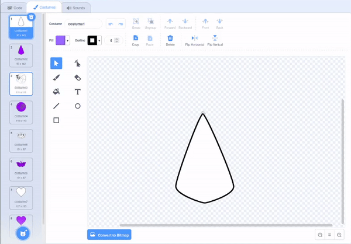

## दुसरे मंडल तयार करा

<div style="display: flex; flex-wrap: wrap">
<div style="flex-basis: 200px; flex-grow: 1; margin-right: 15px;">
तुमचे ऑप्टिमाइझ केलेले कोड ब्लॉक्स वापरून सहजपणे दुसरे मंडल तयार करा.
</div>
<div>

</div>
</div>

तुमच्याकडे दोन कॉश्चुम आहेत जे तुम्ही तुमचा रंगीत मंडल तयार करण्यासाठी वापरत आहात. तुमचे मंडल अधिक जास्त वैयक्तिक करण्यासाठी आणखी काही कॉश्चुम जोडा.

--- task ---

**निवडा:** दुसरा कॉश्चुम जोडा. येथे **Earth** कॉश्चुम निवडलेला आहे.


तुम्ही कोणता कॉश्चुम निवडला हे महत्वाचे नाही, परंतु तुम्ही तो **Vector** कॉश्चुम असल्याची आणि **Bitmap** कॉश्चुम नसल्याची खात्री करायला हवी. तुम्ही **Vector** कॉश्चुम निवडल्याचे सांगू शकता, तुम्हाला **Convert to Bitmap** नावाचे बटन दिसेल. **या बटनवर क्लिक करू नका**. तुम्ही कॉश्चुम निवडल्यास म्हणजेच **Bitmap**, तर तो डिलीट करा आणि दुसरा निवडा.


--- /task ---

--- task ---

कॉश्चुम मधून सर्व रंग काढा ज्यामुळे तुम्हाला केवळ आऊटलाईन मिळेल. पूर्ण कॉश्चुम निवडा आणि **Fill** **Saturation** हे `0` ला आणि **Outline** **Brightness** हे `0` ला बदला.


--- /task ---

--- task ---

हा कॉश्चुम डुप्लीकेट करा, आणि त्यानंतर प्रक्रिया पुन्हा करा, यावेळी रंग तुमच्या आवडीच्या गडद रंगात **Fill** करा.


--- /task ---

--- task ---

कॉश्चुमच्या तुम्हा स्वतःला वेगवेगळ्या स्टाईल देण्यासाठी वेगळ्या व्हेक्टर कॉश्चुमसह ही प्रक्रिया आणखी काही वेळा पुन्हा करा.


--- /task ---

खात्री करण्यासाठी, तुमच्या वैयक्तिक मंडल ला तुम्ही रंग देऊ शकता, तुमचे कॉश्चुमचा पुन्हा क्रम लावू शकता आणि कॉश्चुम योग्य नंबरला बदलला का ते तपासू शकता.

--- task ---

तुमच्या कॉश्चुमचा पुन्हा क्रम लावा, जेणेकरून सर्व पांढरा रंग भरलेले वरच्या भागात येतील, आणि रंग भरलेले सर्व खालच्या भागात येतील, परंतु तरीही त्याच क्रमात.



--- /task ---

मंडल कोणता कॉश्चुम बदलतो ते लक्षात ठेवा जेणेकरून तुम्ही तुमच्या नवीन मंडल ला रंग देऊ शकता. उदाहरण प्रोजेक्टमध्ये, चार मंडल आहेत त्यामुळे आपण कॉश्चुम संख्या 1 ते 4 बदलतो


```blocks3
when this sprite clicked
+ switch costume to ((answer) + (4))
change [color v] effect by (25)
```

--- task ---

**चाचणी:** तुमच्या कॉश्चुम पैकी एक बदला आणि निर्माण झालेला पॅटर्न बघण्यासाठी हिरव्या झेंड्यावर क्लिक करा.

--- /task ---

--- save ---
