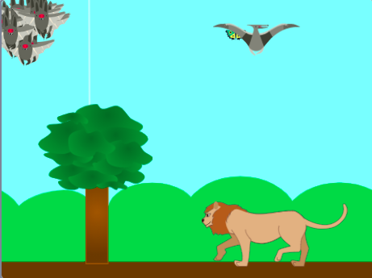

## Wat kun je verder nog doen?

Als je het [Verder met Scratch](https://projects.raspberrypi.org/en/pathways/further-scratch) pad volgt, kun je naar het [Zwermen, scholen en kuddes](https://projects.raspberrypi.org/en/projects/swarms-schools-flocks) project gaan. In dit project maak je een spel dat klonen gebruikt om een simulatie van een groep dieren te maken.

--- print-only ---

--- /print-only ---

--- no-print ---

  <iframe allowtransparency="true" width="485" height="402" src="https://scratch.mit.edu/projects/embed/546736449/?autostart=false" frameborder="0"></iframe>

--- /no-print ---

Wil je nog meer plezier hebben met het het verkennen van Scratch, dan kun je een van [deze projecten](https://projects.raspberrypi.org/en/projects?software%5B%5D=scratch&curriculum%5B%5D=%201) proberen.
